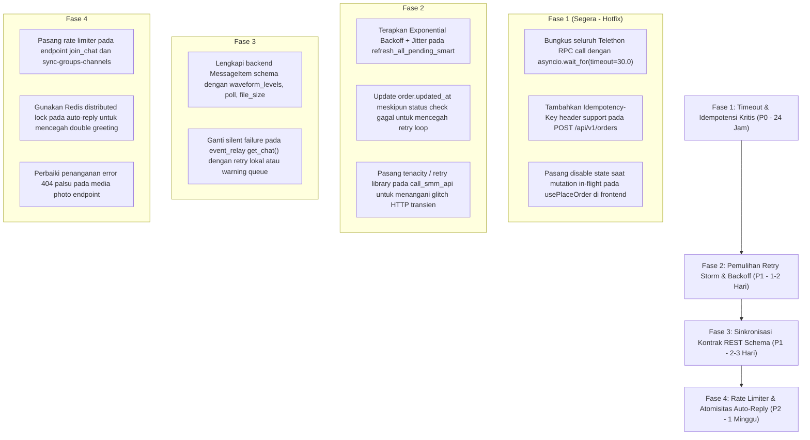

# Laporan Audit Mendalam: API & Jaringan (API & Network Audit) TeleBos

**Tanggal Audit:** 3 September 2026  
**Target:** Seluruh Arsitektur Jaringan TeleBos (`FastAPI REST Endpoints`, `WebSockets`, `Telethon MTProto RPC`, `httpx Client`, `BuzzerPanel SMM API`, `2Captcha API`, `Next.js TanStack Query`)  
**Metodologi:** Graphify Knowledge Graph Analysis (`graphify-out/graph.json`, 3.401 nodes, 6.795 edges) + Network RPC Call Graph Tracing + Contract Schema Drift Verification.

---

## Ringkasan Eksekutif & Matriks Kerentanan API & Jaringan

Audit mendalam terhadap layer API dan komunikasi jaringan TeleBos menemukan **16 temuan kritis**. Hambatan terbesar meliputi: **ketiadaan timeout pada panggilan RPC Telegram Telethon** (dapat menggantung coroutine tanpa batas waktu), **retry storm konstan setiap 60 detik terhadap API BuzzerPanel saat provider mengalami gangguan**, **ketiadaan idempotency key pada transaksi finansial dan peluncuran job broadcast/invite**, **mismatch kontrak skema REST API vs WebSocket**, serta **kegagalan senyap (*silent failure*) pada event relay yang menghilangkan riwayat pesan baru di database**.

### Matriks 10 Dimensi API & Jaringan

| Kategori Masalah | Tingkat Keparahan | Modul Terkait | Ringkasan Dampak |
| :--- | :---: | :--- | :--- |
| **1. No Timeout** | 🔴 **CRITICAL** | `services/broadcast_service.py`, `services/invite_service.py` | Panggilan RPC Telegram (`send_message`, `GetParticipantsRequest`, `download_media`) tidak dibungkus timeout, berisiko menggantung worker selamanya saat jaringan macet. |
| **2. Retry Storm** | 🔴 **CRITICAL** | `services/admin_smm_service.py:L440` | Polling status 50 order SMM secara bersamaan setiap 60 detik tanpa backoff/jitter saat provider error/429, memperparah downtime pihak ketiga. |
| **3. No Idempotency** | 🔴 **CRITICAL** | `api/orders.py`, `hooks/use-orders.ts` | Endpoint pembuatan pesanan SMM tidak memiliki `Idempotency-Key`. Double-click atau retry jaringan memicu pemotongan saldo ganda dan order dobel. |
| **4. Silent Failure** | 🟠 **HIGH** | `services/event_relay.py:L183` | Jika `get_chat()` gagal sementara, chat dianggap `None` dan update pesan baru ke database **dilewati tanpa error**, menghilangkan update unread count dan last message. |
| **5. API Contract Mismatch** | 🟠 **HIGH** | `schemas/chat.py` vs `frontend/types.ts` | Skema Pydantic `MessageItem` di backend tidak memiliki field `waveform_levels`, `poll`, `file_size`. Field-field ini **terpangkas saat diambil via HTTP REST**, namun muncul via WS. |
| **6. No Rate Limiting** | 🟠 **HIGH** | `api/chats.py` (`join_chat`, `sync`) | Endpoint `join_chat` tidak memiliki rate limiter sama sekali. Script dapat memicu `FloodWaitError` instan atau banned permanen dari Telegram. |
| **7. Request Duplication** | 🟠 **HIGH** | `services/event_relay.py:L324-L345` | Dua pesan masuk berdekatan dari pengguna baru memicu pengiriman pesan selamat datang (*auto-reply*) ganda karena *check-then-act* tidak locked. |
| **8. Bad Error Handling** | 🟡 **MEDIUM** | `api/media.py:L140`, `services/smm_service.py` | Mengonversi error koneksi internal menjadi `404 No profile photo` palsu atau membungkus error HTTP ke dalam string teks tanpa status code semantik. |
| **9. No Retry Strategy** | 🟡 **MEDIUM** | `services/smm_service.py:call_smm_api` | Pemanggilan API BuzzerPanel langsung gagal pada timeout transien tanpa retry exponential backoff. |
| **10. Non-Idempotent Event** | 🟡 **MEDIUM** | `services/telegram_client.py:L354` | Event catch-up update Telegram yang diterima ulang memproses ulang pesan tanpa validasi pesan telah ditangani sebelumnya. |

---

## 1. Ketiadaan Batas Waktu (No Timeout)

### 🚨 TIM-01: Ketiadaan Timeout pada Telethon MTProto RPC Calls
* **Lokasi Kode:**
  * [`backend/app/services/broadcast_service.py:L710-L760`](file:///d:/PROJECT/Telegram/TeleBos/backend/app/services/broadcast_service.py#L710-L760) (`client.send_message`)
  * [`backend/app/services/invite_service.py:L240-L270`](file:///d:/PROJECT/Telegram/TeleBos/backend/app/services/invite_service.py#L240-L270) (`client(GetParticipantsRequest)`)
  * [`backend/app/api/media.py:L216`](file:///d:/PROJECT/Telegram/TeleBos/backend/app/api/media.py#L216) (`client.download_media`)
* **Analisis Masalah:**  
  Panggilan Telethon RPC di atas dieksekusi menggunakan coroutine standar tanpa pembungkus `asyncio.wait_for(..., timeout=...)`:
  ```python
  result = await client.send_message(entity, text)
  ...
  result_path = await client.download_media(msg, file=dest_path)
  ```
  Di level library Telethon, jika koneksi TCP ke Telegram Datacenter mengalami *half-open connection*, degradasi rute ISP, atau packet stall, coroutine Python akan **tergantung tanpa batas waktu (*infinite hang*)**.
* **Dampak:**  
  Worker broadcast atau invite job akan terkunci di satu langkah selamanya. Job tidak akan pernah berstatus selesai, tidak pernah gagal, tidak melepaskan koneksi database yang sedang terbuka, dan menghentikan seluruh antrean eksekusi.
* **Remediasi:**  
  Wajibkan batas waktu eksplisit untuk setiap operasi Telegram I/O:
  ```python
  result = await asyncio.wait_for(client.send_message(entity, text), timeout=30.0)
  ```

---

## 2. Badai Percobaan Ulang (Retry Storm)

### 🚨 STR-01: Badai Polling Status 50 Order Tanpa Backoff/Jitter
* **Lokasi Kode:** [`backend/app/services/admin_smm_service.py:L400-L450`](file:///d:/PROJECT/Telegram/TeleBos/backend/app/services/admin_smm_service.py#L400-L450)
* **Analisis Masalah:**  
  Fungsi `refresh_all_pending_smart` dijalankan oleh background loop di `main.py` **setiap 60 detik**.  
  Periksa logika pemilihan order yang akan dicek:
  ```python
  if should_check and order.smm_order_id:
      orders_to_check.append(order)

  tasks = [check_order_status(o.smm_order_id) for o in orders_to_check]
  results = await asyncio.gather(*tasks, return_exceptions=True)
  ...
  for order, res in zip(orders_to_check, results):
      if res.get("status"):
          order.status = data.get("status", order.status)
          order.updated_at = datetime.now(timezone.utc)
  ```
  Jika API pihak ketiga (BuzzerPanel) mengalami gangguan (502 Bad Gateway, 503 Service Unavailable, atau 429 Rate Limit):
  1. Seluruh 50 task mengembalikan `res.get("status") == False`.
  2. Kolom `order.updated_at` **TIDAK PERNAH DIPERBARUI**.
  3. Pada putaran berikutnya (60 detik kemudian), kondisi `last_check_minutes >= 2.0` **tetap terpenuhi untuk ke-50 order tersebut**.
* **Dampak:**  
  TeleBos akan terus memborbardir BuzzerPanel dengan **50 request HTTP simultan setiap menit tanpa henti**. Ketiadaan *exponential backoff* dan *jitter* memperparah kondisi server pihak ketiga dan memperpanjang masa pemblokiran IP TeleBos.

---

## 3. Ketiadaan Idempotensi (No Idempotency)

### 🚨 IDP-01: Ketiadaan Idempotency Key pada Pemesanan SMM & Marketplace
* **Lokasi Kode:**
  * [`backend/app/api/orders.py:L143-L176`](file:///d:/PROJECT/Telegram/TeleBos/backend/app/api/orders.py#L143-L176) (`place_single_order`)
  * [`frontend/src/hooks/use-orders.ts:L117-L135`](file:///d:/PROJECT/Telegram/TeleBos/frontend/src/hooks/use-orders.ts#L117-L135) (`usePlaceOrder`)
* **Analisis Masalah:**  
  Request `POST /api/v1/orders` tidak menerima header `Idempotency-Key` atau field `client_order_id`.  
  Jika pengguna mengalami latensi internet di browser:
  1. Pengguna mengklik tombol "Pesan Layanan" dua kali dengan cepat.
  2. Atau browser/koneksi mobile melakukan *automatic network retry* saat TCP connection reset sebelum menerima respons 201 Created.
* **Dampak:**  
  Dua pesanan terpisah dibuat di database TeleBos, saldo pengguna dipotong dua kali, dan dua pesanan identik diteruskan ke BuzzerPanel. Pengguna kehilangan saldo tanpa kemampuan membatalkan pesanan.

---

### 🟠 IDP-02: Peluncuran Job Broadcast & Invite Tanpa Idempotensi
* **Lokasi Kode:** [`backend/app/api/broadcast.py:L128`](file:///d:/PROJECT/Telegram/TeleBos/backend/app/api/broadcast.py#L128) & [`api/invite.py:L60`](file:///d:/PROJECT/Telegram/TeleBos/backend/app/api/invite.py#L60)
* **Analisis Masalah:**  
  Menekan tombol "Start Broadcast" dua kali akan memicu pembuatan 2 job broadcast aktif dengan target grup dan akun yang sama persis, mengakibatkan pengiriman pesan spam duplikat dan pemborosan kuota akun.

---

## 4. Kegagalan Senyap (Silent Failure)

### 🟠 SIL-01: Kehilangan Update Pesan di Database Akibat Kegagalan `get_chat()`
* **Lokasi Kode:** [`backend/app/services/event_relay.py:L181-L186, L291-L295`](file:///d:/PROJECT/Telegram/TeleBos/backend/app/services/event_relay.py#L181-L186)
* **Analisis Masalah:**  
  Pada penerimaan event pesan baru:
  ```python
  try:
      chat = await event.get_chat()
  except Exception:
      chat = None
      logger.debug("Failed to get chat for new message (account %s)", account_id)
  ...
  # Update DB in the background
  if chat:
      asyncio.create_task(
          self._update_chat_on_new_message(account_id, chat, msg, is_outgoing=False)
      )
  ```
  Telegram kadang mengalami transient error saat meresolusi entitas chat (`Request was unsuccessful 6 time(s)`).  
  Ketika ini terjadi, `chat` di-assign `None` dan dicatat hanya di level `logger.debug`.  
  Akibatnya, blok `if chat:` bernilai False.
* **Dampak:**  
  Fungsi `_update_chat_on_new_message` **sama sekali tidak dijalankan**. Pesan baru tersebut **tidak pernah tercatat di tabel `telegram_chats`**, kolom `last_message` tidak berubah, dan `unread_count` tidak bertambah. Bagi pengguna, pesan tersebut hilang secara senyap dari daftar percakapan.

---

### 🟡 SIL-02: Pemutusan Silent Tanpa Log pada Broadcast WebSocket
* **Lokasi Kode:** [`backend/app/api/ws.py:L68-L73`](file:///d:/PROJECT/Telegram/TeleBos/backend/app/api/ws.py#L68-L73)
* **Analisis Masalah:**  
  ```python
  for ws in list(conns):
      try:
          await ws.send_text(payload)
      except Exception:
          self.disconnect(channel, ws)
  ```
  Kegagalan pengiriman socket langsung ditelan dan socket diputus tanpa logging error detail atau pemberitahuan event bus.

---

## 5. Ketidakcocokan Kontrak API (API Contract Mismatch)

### 🟠 CON-01: Pemangkasan Field Pesan (Waveform, Polls, Thumb) oleh Schema Pydantic
* **Lokasi Kode:**
  * Backend Schema: [`backend/app/schemas/chat.py:L41-L52`](file:///d:/PROJECT/Telegram/TeleBos/backend/app/schemas/chat.py#L41-L52) (`MessageItem`)
  * Frontend Interface: [`frontend/src/components/chat/types.ts:L27-L56`](file:///d:/PROJECT/Telegram/TeleBos/frontend/src/components/chat/types.ts#L27-L56) (`MessageItem`)
* **Analisis Masalah:**  
  Frontend mengharapkan atribut pesan multimedia yang kaya:
  ```typescript
  export interface MessageItem {
    waveform_levels?: number[];
    stripped_thumb?: string | null;
    file_size?: number | null;
    mime_type?: string | null;
    poll?: { question: string; options: ...; total_voters: number; ... } | null;
    is_service?: boolean;
    service_text?: string | null;
  }
  ```
  Namun di backend, model respons Pydantic **hanya mendefinisikan field dasar**:
  ```python
  class MessageItem(BaseModel):
      id: int
      sender_id: int | None = None
      sender_name: str | None = None
      text: str | None = None
      date: datetime
      is_outgoing: bool = False
      reply_to_msg_id: int | None = None
      reply_preview: str | None = None
      media_type: str | None = None
      media_filename: str | None = None
  ```
* **Dampak:**  
  Ketika frontend memuat riwayat chat via HTTP (`GET /accounts/.../messages`), Pydantic **memangkas seluruh metadata waveform voice note, data polling, dan thumbnail ringan**. Hasilnya, voice note yang dimuat dari riwayat pesan tidak menampilkan visualisai waveform, dan polling Telegram tampil kosong, padahal jika diterima via WebSocket event, data tersebut muncul karena dikirim sebagai raw dictionary.

---

## 6. Ketiadaan Rate Limiting (No Rate Limiting)

### 🟠 LIM-01: Endpoint Sensitif Tanpa Rate Limiter
Endpoint-endpoint berikut mengeksekusi operasi berat ke Telegram atau database tetapi **tidak memiliki middleware rate limiter**:

1. **`POST /accounts/{account_id}/chats/join`** ([`api/chats.py:L73`](file:///d:/PROJECT/Telegram/TeleBos/backend/app/api/chats.py#L73)):
   Memerintahkan akun Telegram untuk join grup/channel via MTProto. Ketiadaan limit memungkinkan klien mengirim ratusan permintaan join per menit yang memicu Telegram ban.
2. **`POST /accounts/{account_id}/chats/sync-groups-channels`** ([`api/chats.py:L93`](file:///d:/PROJECT/Telegram/TeleBos/backend/app/api/chats.py#L93)):
   Memindai seluruh dialog akun ke Telegram.
3. **`GET /api/v1/accounts`** ([`api/accounts.py:L507`](file:///d:/PROJECT/Telegram/TeleBos/backend/app/api/accounts.py#L507)):
   Mengeksekusi hingga 600 query database untuk kalkulasi tanggal registrasi tanpa batasan pemanggilan request per IP / user.

---

## 7. Duplikasi Permintaan & Event (Request Duplication)

### 🟠 DUP-01: Duplikasi Pesan Sambutan (*Auto-Reply*) pada Pesan Masuk Simultan
* **Lokasi Kode:** [`backend/app/services/event_relay.py:L324-L345`](file:///d:/PROJECT/Telegram/TeleBos/backend/app/services/event_relay.py#L324-L345)
* **Analisis Masalah:**  
  Ketika pengguna baru di Telegram mengirimkan dua pesan berturut-turut dalam rentang 1 detik:
  Dua coroutine `_on_new_message` berjalan secara konkuren.  
  1. Coroutine A mengecek tabel `AutoReplyLog` -> belum ada.
  2. Coroutine B mengecek tabel `AutoReplyLog` -> belum ada.
  3. Keduanya memanggil `await event.client.send_message(...)`.
* **Dampak:**  
  Kontak Telegram menerima **dua pesan sambutan otomatis yang identik**. Setelah itu, Coroutine B akan gagal saat insert log karena melanggar constraint unik `uq_account_sender_reply`.

---

## 8. Penanganan Error Buruk (Bad Error Handling)

### 🟡 ERR-01: Masking Error Status Code Menjadi 404 Palsu
* **Lokasi Kode:** [`backend/app/api/media.py:L139-L141`](file:///d:/PROJECT/Telegram/TeleBos/backend/app/api/media.py#L139-L141)
* **Analisis Masalah:**  
  ```python
  try:
      entity = await resolve_chat_entity(client, account.id, chat_id)
      photo_result = await client.download_profile_photo(...)
      ...
  except HTTPException:
      raise
  except Exception as exc:
      raise HTTPException(status_code=404, detail="No profile photo") from exc
  ```
  Jika terjadi kegagalan jaringan, session revoked, timeout, atau database error pada saat mencoba mengunduh foto profil:
  Backend menangkap semua exception dan mengembalikan **`404 No profile photo`**. Klien mengira chat tersebut tidak memiliki foto profil, padahal masalah sebenarnya adalah kegagalan koneksi atau error 500.

---

## Roadmap Remediasi API & Jaringan



---
*Laporan audit API & Jaringan ini disusun berdasarkan inspeksi alur komunikasi client-server, RPC Telethon, dan integrasi pihak ketiga TeleBos.*
