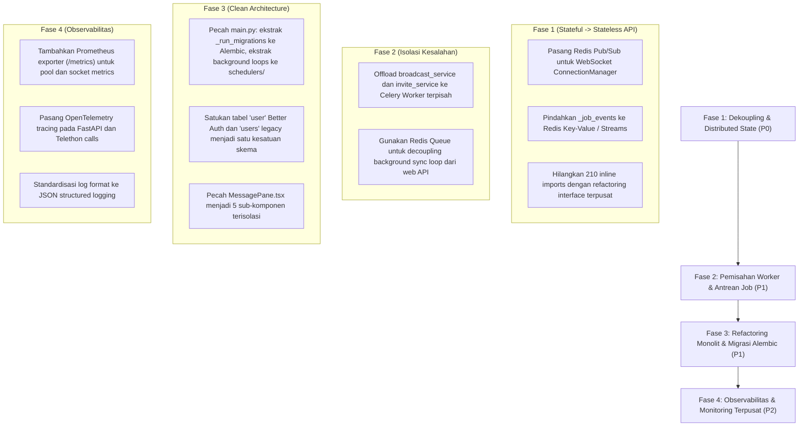

# Laporan Audit Mendalam: Arsitektur Sistem (Architecture Audit) TeleBos

**Tanggal Audit:** 3 September 2026  
**Target:** Seluruh Arsitektur TeleBos (`FastAPI Core`, `Next.js 14 Frontend`, `Telethon MTProto Runtime`, `PostgreSQL Persistence`, `Redis`, `WebSocket Infrastructure`, `Background Workers`)  
**Metodologi:** Graphify Knowledge Graph Analysis (`graphify-out/graph.json`, 3.401 nodes, 6.795 edges) + Component Coupling & Cohesion Analysis + Distributed System Failure Mode Modeling.

---

## Ringkasan Eksekutif & Matriks Arsitektur Sistem

Audit mendalam terhadap arsitektur TeleBos mengungkap **18 kelemahan struktural mendasar** yang menghambat skalabilitas horizontal, keandalan operasional, dan pemeliharaan jangka panjang. Sistem saat ini beroperasi sebagai **Monolitik State-Heavy dalam Satu Proses (Stateful Monolith)**: koneksi Telegram aktif, otentikasi login QR, status event job, dan routing WebSocket disimpan di memori lokal proses Python tunggal, sehingga **aplikasi tidak dapat di-scale secara horizontal (multi-instance)**. Selain itu, ditemukan **210 impor sirkular yang disembunyikan di dalam badan fungsi**, **pencampuran tanggung jawab berat (SoC) pada file-file raksasa (1.400+ baris)**, dan **ketiadaan observabilitas metrik / tracing terdistribusi**.

### Matriks 10 Dimensi Arsitektur Sistem

| Dimensi Arsitektur | Tingkat Risiko | Komponen Utama | Ringkasan Dampak Arsitektur |
| :--- | :---: | :--- | :--- |
| **1. Single Point of Failure** | 🔴 **CRITICAL** | `telegram_client.py`, `pending_login_service.py` | State klien Telegram dan login OTP/QR terisolasi di memori RAM satu proses. Jika server restart, seluruh sesi koneksi putus serentak. |
| **2. Scalability Bottleneck** | 🔴 **CRITICAL** | `ConnectionManager`, `async_helpers.py` | Tidak ada message broker (Redis Pub/Sub) untuk WebSocket dan Job Event. Menjalankan 2 worker backend membuat event tidak tersinkronisasi. |
| **3. Circular Dependency** | 🔴 **CRITICAL** | `services/` <-> `api/` <-> `database.py` | 210 inline imports di dalam badan fungsi untuk menambal siklus ketergantungan antar modul yang saling mengimpor singleton. |
| **4. Poor Fault Isolation** | 🔴 **CRITICAL** | `main.py`, `broadcast_service.py` | Job broadcast dan invite berjalan sebagai `asyncio.create_task` di event loop yang sama dengan server web API, bukan worker terisolasi. |
| **5. Spaghetti Architecture** | 🟠 **HIGH** | `backend/app/main.py:L250-L995` | `main.py` bertindak sebagai omnibus god-module (1.413 baris): memuat migrasi DDL raw SQL, 5 loop background, konfigurasi, dan lifespan. |
| **6. Poor Separation of Concerns** | 🟠 **HIGH** | `api/accounts.py`, `MessagePane.tsx` | Kontroller API mengeksekusi DDL, enkripsi, dan RPC Telegram langsung; komponen UI frontend (1.407 baris) menangani 10 tanggung jawab berbeda. |
| **7. System Bottleneck** | 🟠 **HIGH** | `main.py:_adaptive_sequential_sync_loop` | Sinkronisasi dialog Telegram dijalankan secara serial 1 akun setiap 15 detik. Pada 500 akun, satu siklus sync membutuhkan waktu > 2 jam. |
| **8. Technical Debt** | 🟠 **HIGH** | Dual-User Architecture (`"user"` vs `users`) | Skema user terbelah dua antara Better Auth dan legacy table dengan adapter manual di dependensi autentikasi. |
| **9. No Observability** | 🟡 **MEDIUM** | Seluruh Sistem Backend & Frontend | Tidak ada endpoint `/metrics` Prometheus, tidak ada distributed tracing (OpenTelemetry), log berupa raw string tanpa correlation ID. |
| **10. Premature Optimization** | 🟡 **MEDIUM** | `telegram_client.py:CLIENT_TTL_SECONDS` | Eviksi klien Telegram setiap 300 detik memicu flapping koneksi dan lonjakan reconnect handshake berulang. |

---

## 1. Titik Kegagalan Tunggal (Single Point of Failure - SPOF)

### 🚨 ARC-01: Stateful In-Memory Session & Client Pool
* **Lokasi Kode:**
  * [`backend/app/services/telegram_client.py:L38`](file:///d:/PROJECT/Telegram/TeleBos/backend/app/services/telegram_client.py#L38) (`self._clients`)
  * [`backend/app/services/pending_login_service.py:L29-L37`](file:///d:/PROJECT/Telegram/TeleBos/backend/app/services/pending_login_service.py#L29-L37)
  * [`backend/app/api/accounts.py:L50`](file:///d:/PROJECT/Telegram/TeleBos/backend/app/api/accounts.py#L50) (`_pending_qr_logins`)
* **Analisis Arsitektur:**  
  Aplikasi menyimpan seluruh koneksi TCP MTProto Telegram aktif, state otorisasi kode OTP, dan status login QR code di dalam dictionary memori proses Python tunggal (`dict`).  
  Bahkan dokumentasi internal mengakui:
  ```python
  """Owns unauthenticated Telethon clients for one process only.
  Clients cannot be put in Redis safely, so deployments with multiple backend
  workers must use sticky routing for these short-lived login endpoints."""
  ```
* **Dampak:**  
  1. **Zero High-Availability:** Jika proses backend mengalami crash, OOM, atau restart deployment: seluruh koneksi Telegram putus serentak, semua proses login yang sedang berlangsung gagal, dan server harus melakukan *reconnect storm* ke ratusan akun Telegram saat menyala kembali.
  2. **Terkunci pada Arsitektur Single-Instance:** Aplikasi tidak dapat didistribusikan di balik load balancer standar (round-robin) tanpa mematahkan flow login dan routing WebSocket.

---

## 2. Hambatan Skalabilitas Horizontal (Scalability Bottlenecks)

### 🚨 ARC-02: Ketiadaan Event Bus / Pub-Sub untuk WebSocket & Job Control
* **Lokasi Kode:**
  * [`backend/app/api/ws.py:L33-L78`](file:///d:/PROJECT/Telegram/TeleBos/backend/app/api/ws.py#L33-L78) (`ConnectionManager`)
  * [`backend/app/utils/async_helpers.py:L9-L30`](file:///d:/PROJECT/Telegram/TeleBos/backend/app/utils/async_helpers.py#L9-L30) (`_job_events`)
* **Analisis Arsitektur:**  
  `ConnectionManager` menyimpan client WebSocket dalam set lokal: `self._connections: dict[str, set[WebSocket]]`.  
  Demikian pula, sistem sinkronisasi jeda dan bangun job menggunakan `asyncio.Event` lokal: `_job_events: dict[str, asyncio.Event]`.
* **Kelemahan Desain:**  
  Jika TeleBos dijalankan dengan 2 instance server di Kubernetes atau Docker Compose:
  - Pengguna terhubung ke WebSocket di Server A.
  - Event Telegram diterima atau job broadcast diperbarui oleh worker di Server B.
  - Server B memanggil `manager.broadcast()`, tetapi karena koneksi socket pengguna berada di Server A, **pengguna di Server A TIDAK PERNAH menerima update status secara real-time!**
  - Mengklik "Pause" pada dashboard yang mendarat di Server A tidak dapat membangunkan job yang berjalan di Server B.
* **Solusi Arsitektur:**  
  Ganti `ConnectionManager` dan `_job_events` lokal dengan **Redis Pub/Sub** atau **Redis Streams** sebagai distributed message bus.

---

### 🟠 ARC-03: Bottleneck Sinkronisasi Serial Akun Telegram
* **Lokasi Kode:** [`backend/app/main.py:L1170-L1215`](file:///d:/PROJECT/Telegram/TeleBos/backend/app/main.py#L1170-L1215) (`_adaptive_sequential_sync_loop`)
* **Analisis Arsitektur:**  
  Background loop sinkronisasi chat Telegram mengeksekusi:
  ```python
  stmt = (
      select(TelegramAccount)
      .where(TelegramAccount.is_active == True, TelegramAccount.for_sale == False)
      .order_by(TelegramAccount.last_sync_at.asc().nullsfirst())
      .limit(1)  # HANYA SATU AKUN PER INTERVAL
  )
  ...
  await asyncio.sleep(15)  # DELAY 15 DETIK SETIAP SATU AKUN
  ```
* **Kalkulasi Skalabilitas:**  
  - 10 Akun: `10 × 15s = 150 detik` (2,5 menit per siklus).
  - 100 Akun: `100 × 15s = 1.500 detik` (25 menit per siklus).
  - 500 Akun: `500 × 15s = 7.500 detik` (**2 jam 5 menit** untuk menyinkronkan seluruh akun).
* **Dampak:**  
  Pada skala ratusan akun, data pesan, unread count, dan status akun tertinggal berjam-jam di belakang Telegram aslinya. Pendekatan serial ini tidak scalable.

---

## 3. Ketergantungan Sirkular (Circular Dependencies)

### 🚨 ARC-04: 210 Impor Tersembunyi di Dalam Badan Fungsi
* **Lokasi Tersebar:** 210 lokasi di seluruh `backend/app/` (misal: [`telegram_client.py:L439`](file:///d:/PROJECT/Telegram/TeleBos/backend/app/services/telegram_client.py#L439), [`session_manager.py:L75`](file:///d:/PROJECT/Telegram/TeleBos/backend/app/services/session_manager.py#L75), [`account_service.py:L940`](file:///d:/PROJECT/Telegram/TeleBos/backend/app/services/account_service.py#L940), [`event_relay.py:L210`](file:///d:/PROJECT/Telegram/TeleBos/backend/app/services/event_relay.py#L210)).
* **Analisis Masalah:**  
  Grafik ketergantungan modul mengalami siklus tertutup (*cyclic dependency loop*):
  ```
  telegram_client.py ──> event_relay.py ──> client_pool (telegram_client.py)
  account_service.py ──> session_manager.py ──> account_service.py
  broadcast_service.py ──> ws.py (manager) ──> broadcast_service.py
  ```
  Untuk mencegah Python melempar `ImportError: cannot import name ... from partially initialized module`, para pengembang sengaja memindahkan statement `import` ke dalam badan fungsi/metode lokal:
  ```python
  def detach_client(self, account_id: str, client: Any) -> None:
      from app.services.event_relay import event_relay  # <-- Inline import
  ```
* **Dampak Arsitektur:**  
  1. Menutupi cacat desain coupling tinggi.
  2. Menambah overhead eksekusi byte-code import berulang kali pada *hot path*.
  3. Menyulitkan pengujian unit (*unit testing & mocking*) karena dependensi tidak disuntikkan secara eksplisit (*Dependency Injection*).

---

## 4. Isolasi Kesalahan yang Buruk (Poor Fault Isolation)

### 🚨 ARC-05: Eksekusi Long-Running Job Langsung di Web Server Event Loop
* **Lokasi Kode:**
  * [`backend/app/api/broadcast.py:L148`](file:///d:/PROJECT/Telegram/TeleBos/backend/app/api/broadcast.py#L148) -> `broadcast_service.start_broadcast`
  * [`backend/app/services/broadcast_service.py:L260-L270`](file:///d:/PROJECT/Telegram/TeleBos/backend/app/services/broadcast_service.py#L260-L270) (`asyncio.create_task`)
* **Analisis Masalah:**  
  Pekerjaan broadcast massal (mengirim ke ratusan grup selama berjam-jam) dan scraping invite (mengambil 50.000 member) diluncurkan sebagai coroutine background `asyncio.create_task` **di dalam proses FastAPI yang sama yang melayani request HTTP dan WebSocket pengguna**.
* **Dampak Arsitektur:**  
  1. Tidak ada isolasi proses (*no process isolation*). Jika satu job broadcast mengalami memory leak atau CPU spike, seluruh server web API menjadi lambat dan respons HTTP pengguna lain mengalami timeout.
  2. Jika proses web server di-restart (misal deployment update), seluruh job broadcast yang sedang berjalan terputus paksa di tengah jalan.
* **Solusi Arsitektur:**  
  Pisahkan job runner ke dalam worker terpisah menggunakan antrean tugas terdistribusi (**Celery Worker** atau **ARQ**) yang terisolasi dari proses web API.

---

## 5. Arsitektur Spaghetti & God-Module

### 🟠 ARC-06: `main.py` sebagai Omnibus God-Module (1.413 Baris)
* **Lokasi Kode:** [`backend/app/main.py:L1-L1413`](file:///d:/PROJECT/Telegram/TeleBos/backend/app/main.py#L1-L1413)
* **Analisis Masalah:**  
  File `main.py` memiliki derajat koneksi grafik tertinggi (Node Degree = 140) dan memikul terlalu banyak tanggung jawab yang tidak kohesif:
  - **Inisialisasi Aplikasi:** Setup FastAPI, middleware CORS, RealIP, SecurityHeaders.
  - **Migration Engine:** 745 baris skrip migrasi raw SQL imperatif (`_run_migrations`).
  - **Scheduler / Cron Daemon:** 5 background infinite loop konkuren (`_adaptive_sequential_sync_loop`, `_sync_smm_services_loop`, `_poll_pending_orders_loop`, `background_stats_updater`, `background_twofa_updater`).
  - **Direct Data Persistence:** Eksekusi query database langsung di dalam loop startup.
* **Pelanggaran:**  
  Pelanggaran berat terhadap *Single Responsibility Principle (SRP)* dan *Separation of Concerns (SoC)*. Perubahan kecil pada satu query background loop berisiko merusak startup seluruh aplikasi.

---

## 6. Pemisahan Tanggung Jawab Buruk (Poor Separation of Concerns)

### 🟠 ARC-07: Monolitik Komponen Frontend `MessagePane.tsx` (1.407 Baris)
* **Lokasi Kode:** [`frontend/src/components/chat/MessagePane.tsx:L1-L1407`](file:///d:/PROJECT/Telegram/TeleBos/frontend/src/components/chat/MessagePane.tsx#L1-L1407)
* **Analisis Masalah:**  
  Komponen UI chat tunggal ini menangani:
  1. Kontrol audio hardware (`MediaRecorder`, audio stream buffer, timer).
  2. Autocomplete parser (mention member `@`, command `/`, emoji `:`).
  3. Grouping dan pemformatan tanggal seluruh pesan.
  4. Penyimpanan draft pesan ke LocalStorage.
  5. Pengiriman pesan teks, media, dokumen, dan polling.
  6. Context menu, pin/unpin, dan delete message handler.
  7. Rendering DOM pesan.
* **Dampak:**  
  Setiap pembaruan state lokal (seperti timer rekam audio) memicu re-render seluruh Virtual DOM pohon percakapan, menghasilkan kode yang sangat rapuh (*fragile*) dan sulit di-maintain.

---

## 7. Hutang Teknis (Technical Debt)

### 🟠 ARC-08: Skema Identitas Ganda (Dual-User Architecture)
* **Lokasi Kode:** [`backend/app/dependencies.py:L50-L84`](file:///d:/PROJECT/Telegram/TeleBos/backend/app/dependencies.py#L50-L84)
* **Analisis Masalah:**  
  Akibat integrasi Better Auth yang dilakukan di atas skema database legacy:
  - Tabel `"user"` (Better Auth): menyimpan ID bertipe `TEXT`, mengelola nama dan email.
  - Tabel `users` (App TeleBos): menyimpan ID bertipe `UUID`, mengelola saldo, role, dan relasi akun.  
  Di setiap request terotentikasi, backend harus menjalankan query join ganda atau query sekunder untuk memetakan teks user ID Better Auth ke UUID tabel legacy.
* **Dampak:**  
  Overhead query konstan pada setiap request dan risiko anomali referensial jika salah satu tabel tidak tersinkronisasi.

---

## 8. Ketiadaan Observabilitas (No Observability)

### 🟡 ARC-09: Ketiadaan Metrik, Tracing, dan Structured Logging
* **Analisis Masalah:**  
  1. **Tidak Ada Endpoint `/metrics`:** Administrator tidak dapat memantau jumlah koneksi Telegram aktif, ukuran connection pool PostgreSQL, kedalaman antrean job, atau throughput WebSocket menggunakan Prometheus / Grafana.
  2. **Tidak Ada Distributed Tracing:** Tidak ada implementasi OpenTelemetry / Jaeger. Ketika request pengguna mengalami latensi lambat di `GET /accounts`, tidak ada span visual untuk mengetahui apakah bottleneck berada di database query, hashing token, atau Telethon RPC.
  3. **Unstructured Logging:** Log dicatat sebagai teks polos (`logger.info("...")`), menyulitkan parsing dan agregasi otomatis di ELK Stack, Loki, atau Datadog.

---

## 9. Prematur Optimasi (Premature Optimization)

### 🟡 ARC-10: Flapping Koneksi Akibat Eviksi Klien Terlalu Agresif
* **Lokasi Kode:** [`backend/app/services/telegram_client.py:L54`](file:///d:/PROJECT/Telegram/TeleBos/backend/app/services/telegram_client.py#L54)
* **Analisis Masalah:**  
  `CLIENT_TTL_SECONDS = 300` (5 menit).  
  Klien Telethon yang tidak diakses selama 5 menit langsung diputus koneksinya untuk menghemat sedikit RAM. Ketika pengguna membuka kembali tab chat, klien dipaksa membuat koneksi TCP baru dan handshake MTProto dari awal, memicu latensi terasa lambat bagi pengguna dan risiko *flood limit* dari server Telegram.

---

## Roadmap Transformasi Arsitektur TeleBos



---
*Laporan audit arsitektur ini disusun berdasarkan Graphify Knowledge Graph dan analisis ketahanan sistem terdistribusi TeleBos.*
