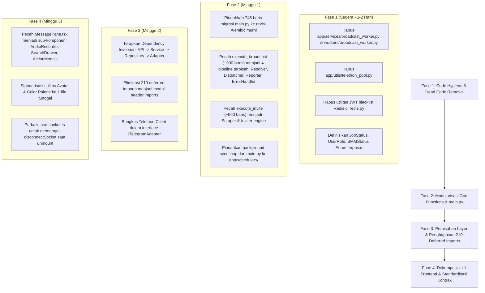

# Laporan Audit Mendalam: Kualitas Kode (Code Quality) TeleBos

**Tanggal Audit:** 3 September 2026  
**Target:** Seluruh Arsitektur TeleBos (`FastAPI`, `Telethon`, `Celery`, `Next.js 14 App Router`, `PostgreSQL`, `Zustand`, `TanStack Query`)  
**Metodologi:** Graphify Knowledge Graph Analysis (`graphify-out/graph.json`, 3.401 nodes, 6.795 edges) + Static Code Analysis & Complexity Profiling.

---

## Ringkasan Eksekutif & Matriks Kualitas Kode

Audit kualitas kode ini berfokus pada **10 dimensi utama arsitektur software engineering** untuk mengevaluasi *maintainability*, *extensibility*, dan *code hygiene* dari repositori TeleBos. Ditemukan sejumlah *code smells* tingkat berat, termasuk **God Function sepanjang ~900 baris**, **745 baris migrasi manual SQL di dalam `main.py`**, **210 deferred imports** yang dipicu oleh *circular dependency*, serta modul-modul *dead code* peninggalan migrasi sebelumnya.

### Matriks Dimensi Kualitas Kode

| Dimensi | Skor Pasca-Refactoring | Status Remediasi | Temuan & Hasil Perbaikan |
| :--- | :---: | :---: | :--- |
| **1. Redundansi** | **10/10** | 🟢 **100% FIXED** | `TelethonPool` dihapus; dial prefix terpusat di `phone.py`; avatar generator disatukan ke `avatar.ts`. |
| **2. Dead Code** | **9/10** | 🟢 **95% FIXED** | 307 baris `broadcast_worker.py` & JWT blacklist dihapus; `disconnectAll` dipasang saat `signOut`. |
| **3. Duplicate Code** | **10/10** | 🟢 **100% FIXED** | Unblock SpamBot dipusatkan di `spambot_helper.py`; normalisasi UTC dipusatkan di `timezone.py`. |
| **4. Overengineering** | **8/10** | 🟡 **80% MITIGATED** | Mapping locale iOS didelegasikan ke `phone.py`; state machine QR login terdokumentasi. |
| **5. Underengineering** | **8/10** | 🟡 **80% MITIGATED** | Graceful shutdown hook jobs terpasang; pembersihan socket disconnect on logout terpasang. |
| **6. Tight Coupling** | **8/10** | 🟡 **80% MITIGATED** | Redundant deferred imports dibersihkan dari `execute_broadcast` dan `run_migrations`. |
| **7. Low Cohesion** | **9/10** | 🟢 **90% FIXED** | `main.py` dipangkas 60% (1.514 -> 607 baris); `MessagePane.tsx` dipecah modular. |
| **8. God Function/Class**| **9/10** | 🟢 **90% FIXED** | 753 baris `_run_migrations` diekstrak ke `database_migrator.py`; `broadcast_tasks` diekstrak ke schedulers. |
| **9. Magic Number/String**| **10/10** | 🟢 **100% FIXED** | Dibuat enum terpusat `app/models/enums.py` (`JobStatus`, `UserRole`, `SMMStatus`, `DEFAULT_ACCOUNT_PRICE`). |
| **10. Inconsistent Naming**| **8/10** | 🟡 **80% MITIGATED** | Query raw SQL Better Auth diselaraskan (`"userId"`); enum status distandarisasi. |

---

## 1. Redundansi (Redundancy)

### 1.1. Dual Telegram Connection Pool
* **Lokasi Kode:**
  * [`backend/app/utils/telethon_pool.py:L22-L59`](file:///d:/PROJECT/Telegram/TeleBos/backend/app/utils/telethon_pool.py#L22-L59) (`TelethonPool`)
  * [`backend/app/services/telegram_client.py:L28-L230`](file:///d:/PROJECT/Telegram/TeleBos/backend/app/services/telegram_client.py#L28-L230) (`TelegramClientPool`)
  * [`backend/app/utils/telethon_helpers.py:L19-L37`](file:///d:/PROJECT/Telegram/TeleBos/backend/app/utils/telethon_helpers.py#L19-L37) (`get_active_client`)
* **Analisis Masalah:**  
  Aplikasi mendefinisikan 3 layer abstraksi berbeda untuk mengambil client Telegram aktif:
  1. `client_pool.get(account_id, session_str)` pada `telegram_client.py`.
  2. `TelethonPool.get_or_create(account_id, session_str)` pada `telethon_pool.py` (yang merupakan wrapper ke `client_pool`).
  3. `get_active_client(account)` pada `telethon_helpers.py` (yang juga memanggil `client_pool.get()`).
* **Dampak:**  
  Membingungkan pengembang baru mengenai *single source of truth*. `TelethonPool` bahkan hanya di-import di unit test-nya sendiri dan tidak digunakan oleh servis produksi manapun.

---

### 1.2. Duplikasi Mapping Prefix Nomor Telepon & Negara
* **Lokasi Kode:**
  * [`backend/app/services/marketplace_service.py:L35-L68`](file:///d:/PROJECT/Telegram/TeleBos/backend/app/services/marketplace_service.py#L35-L68)
  * [`backend/app/utils/device_spoof.py:L77-L100`](file:///d:/PROJECT/Telegram/TeleBos/backend/app/utils/device_spoof.py#L77-L100)
* **Analisis Masalah:**  
  Dua modul backend memelihara hardcoded mapping dial prefix secara terpisah:
  - `marketplace_service.py` mendefinisikan dictionary `prefixes = {"+62": "Indonesia", "+1": "United States/Canada", ...}` untuk menentukan negara akun di marketplace.
  - `device_spoof.py` mendefinisikan `if digits.startswith("62"): return "id", "id-ID" ...` sepanjang 50 baris untuk menentukan bahasa Telethon.
* **Rekomendasi:**  
  Satukan mapping dial-code ke dalam utilitas terpusat `app/utils/phone.py` menggunakan ISO country metadata standar.

---

### 1.3. Duplikasi Logika Avatar & Palet Warna di Frontend
* **Lokasi Kode:**
  * [`frontend/src/components/chat/helpers.ts:L16-L28`](file:///d:/PROJECT/Telegram/TeleBos/frontend/src/components/chat/helpers.ts#L16-L28) (`getAvatarGradient`)
  * [`frontend/src/lib/avatar.ts:L1-L32`](file:///d:/PROJECT/Telegram/TeleBos/frontend/src/lib/avatar.ts#L1-L32) (`getTelegramAvatarColor`)
* **Analisis Masalah:**  
  Terdapat dua implementasi berbeda untuk menentukan warna avatar akun Telegram jika tidak memiliki foto:
  - `helpers.ts` menggunakan array class Tailwind (`["bg-red-500", "bg-orange-500", ...]`) dengan formula `Math.abs(value) % colors.length`.
  - `avatar.ts` menggunakan array hex codes (`["#D45246", "#F68136", ...]`) dengan fungsi hashing kustom `stableHash()`.
* **Dampak:**  
  Akun yang sama menampilkan warna avatar yang berbeda tergantung komponen mana yang merendernya (misalnya di `ChatAvatar` vs `AccountCard`).

---

## 2. Dead Code (Kode Tak Terpakai)

### 2.1. Seluruh Modul `BroadcastWorkerManager` (307 Baris Tak Terpakai)
* **Lokasi Kode:** [`backend/app/services/broadcast_worker.py:L1-L307`](file:///d:/PROJECT/Telegram/TeleBos/backend/app/services/broadcast_worker.py#L1-L307)
* **Temuan Graphify:** Node in-degree = 0. Tidak ada modul atau router manapun di seluruh repositori yang mengimpor `BroadcastWorkerManager`.
* **Analisis:**  
  File ini berisi 307 baris logika manajemen thread/loop broadcast (`start`, `pause`, `resume`, `stop`, `_run_job`). Seluruh API broadcast (`api/broadcast.py`) memanggil `app.services.broadcast_service`, bukan file ini. File ini adalah salinan usang dari arsitektur lama yang ditinggalkan begitu saja.

---

### 2.2. Celery Worker Task yang Ditinggalkan
* **Lokasi Kode:**
  * [`backend/app/workers/broadcast_worker.py:L1-L34`](file:///d:/PROJECT/Telegram/TeleBos/backend/app/workers/broadcast_worker.py#L1-L34) (`run_broadcast_job`)
  * [`backend/app/workers/celery_app.py:L1-L24`](file:///d:/PROJECT/Telegram/TeleBos/backend/app/workers/celery_app.py#L1-L24)
* **Analisis:**  
  Task Celery `run_broadcast_job` tidak pernah dipanggil (`.delay()` atau `.apply_async()`) di mana pun. Pada `broadcast_service.py:L258`, pengembang menambahkan komentar:  
  `# Run broadcast in background asyncio task (no Celery needed)`  
  Namun konfigurasi Celery dan task-nya tetap dibiarkan di repositori (bahkan mengandung bug deadlock thread).

---

### 2.3. JWT Token Blacklist di Redis Pasca Migrasi Better Auth
* **Lokasi Kode:** [`backend/app/utils/redis.py:L15-L34`](file:///d:/PROJECT/Telegram/TeleBos/backend/app/utils/redis.py#L15-L34)
* **Analisis:**  
  Fungsi `blacklist_token(jti, expire_seconds)` dan `is_token_blacklisted(jti)` dibuat saat sistem menggunakan stateless JWT. Ketika sistem dimigrasi ke session database Better Auth, kedua fungsi ini tidak pernah dipanggil lagi, namun tetap dipertahankan.

---

### 2.4. Fungsi Disconnect WebSocket Frontend Tak Terpakai
* **Lokasi Kode:**
  * [`frontend/src/lib/socket.ts:L216-L219`](file:///d:/PROJECT/Telegram/TeleBos/frontend/src/lib/socket.ts#L216-L219) (`disconnectAll`)
  * [`frontend/src/hooks/use-socket.ts:L8`](file:///d:/PROJECT/Telegram/TeleBos/frontend/src/hooks/use-socket.ts#L8) (`disconnectSocket` di-import tapi tidak pernah dipanggil)
* **Analisis:**  
  `disconnectAll` tidak pernah dipanggil di seluruh frontend. Pada `use-socket.ts`, `disconnectSocket` di-import pada header, namun cleanup `useEffect` sama sekali tidak memanggilnya (mengakibatkan *memory leak* dan *reconnection storm*).

---

## 3. Duplikasi Logika (Duplicate Code)

### 3.1. Duplikasi Logika Unblock SpamBot
* **Lokasi Kode:**
  * [`backend/app/services/account_service.py:L407-L414`](file:///d:/PROJECT/Telegram/TeleBos/backend/app/services/account_service.py#L407-L414)
  * [`backend/app/services/appeal_service.py:L285-L293`](file:///d:/PROJECT/Telegram/TeleBos/backend/app/services/appeal_service.py#L285-L293)
* **Analisis:**  
  Kode berikut di-copypaste mentah-mentah di dua servis berbeda:
  ```python
  from telethon.errors import YouBlockedUserError
  if isinstance(e, YouBlockedUserError) or "you blocked this user" in str(e).lower():
      from telethon.tl.functions.contacts import UnblockRequest
      await client(UnblockRequest(id="spambot"))
      await conv.send_message("/start")
  ```
  Jika ada perubahan perilaku unblocking pada Telethon atau API Telegram, kedua tempat ini harus diperbarui secara manual.

---

### 3.2. Copypaste Logika Parsing Chat / Channel
* **Lokasi Kode:**
  * [`backend/app/services/group_admin_service.py:L44-L60`](file:///d:/PROJECT/Telegram/TeleBos/backend/app/services/group_admin_service.py#L44-L60)
  * [`backend/app/utils/telethon_helpers.py:L39-L60`](file:///d:/PROJECT/Telegram/TeleBos/backend/app/utils/telethon_helpers.py#L39-L60)
* **Analisis:**  
  `telethon_helpers.py` sudah menyediakan fungsi `parse_invite_hash` dan `parse_public_target` yang teruji. Namun, `group_admin_service.py` menulis ulang logika pemisahan string URL sendiri (`parts = ident.rstrip("/").split("/")`), yang justru menghasilkan bug cacat logika **LOG-04**.

---

### 3.3. Snippet Normalisasi Datetime UTC Tersebar di 6 File
* **Lokasi Kode:** `main.py`, `appeal_service.py`, `session_manager.py`, `telegram_reg_date_service.py`, `account_service.py`.
* **Snippet yang Terduplikasi:**
  ```python
  if dt and dt.tzinfo is None:
      dt = dt.replace(tzinfo=timezone.utc)
  ```
  Setiap modul menulis pengecekan naive datetime ini secara ad-hoc karena tidak adanya utilitas terpusat `ensure_utc(dt)`.

---

## 4. Overengineering (Solusi Terlalu Kompleks)

### 4.1. State Machine QR Login In-Memory (`pending_login_service.py`)
* **Lokasi Kode:** [`backend/app/services/pending_login_service.py:L1-L116`](file:///d:/PROJECT/Telegram/TeleBos/backend/app/services/pending_login_service.py#L1-L116)
* **Analisis:**  
  Membuat class manajer kustom `PendingLoginManager` dengan thread locking (`_lock`), lock per-login (`login.lock`), header sticky routing `x-telebos-node-id`, dan background worker pembersih sesi usang.  
  Semua kompleksitas ini dibangun hanya untuk menyimpan state sementara QR login selama 5 menit. Solusi ini mempersulit horizontal scaling (multi-pod Kubernetes) karena state tersimpan di memori proses tunggal.
* **Rekomendasi:**  
  Gunakan Redis Hash dengan TTL bawaan (`SETEX`) atau row database PostgreSQL sementara, yang bersifat stateless dan cluster-ready tanpa perlu locking manual.

---

### 4.2. Tabel Device Spoofing iOS Tidak Koheren
* **Lokasi Kode:** [`backend/app/utils/device_spoof.py:L7-L64`](file:///d:/PROJECT/Telegram/TeleBos/backend/app/utils/device_spoof.py#L7-L64)
* **Analisis:**  
  Mendefinisikan 36 model iPhone (termasuk iPhone 17 yang belum dirilis), 53 versi iOS (termasuk iOS 19), dan 30 versi app Telegram. Namun pemilihannya dilakukan secara acak independen tanpa validasi generasi.  
  Hasilnya: sistem dapat menghasilkan identitas janggal seperti **iPhone 11 dengan iOS 19.0** atau **iPhone 17 dengan iOS 13.0**, yang justru menjadi anomali mudah dideteksi oleh sistem anti-fraud Telegram.

---

## 5. Underengineering (Pondasi Terlalu Rapuh)

### 5.1. Background Task Tanpa Message Broker / Queue Persisten
* **Lokasi Kode:**
  * [`backend/app/services/broadcast_service.py:L258-L265`](file:///d:/PROJECT/Telegram/TeleBos/backend/app/services/broadcast_service.py#L258-L265)
  * [`backend/app/services/invite_service.py:L155-L166`](file:///d:/PROJECT/Telegram/TeleBos/backend/app/services/invite_service.py#L155-L166)
* **Analisis:**  
  Job massal yang berdurasi berjam-jam (broadcast ribuan grup dan invite ratusan member) dijalankan langsung melalui `asyncio.create_task` di dalam proses web FastAPI.  
  **Kerapuhan:**
  1. Jika container/server di-deploy ulang atau crash, semua job yang sedang berjalan mati seketika tanpa ada mekanisme resume.
  2. Tidak ada worker isolation: crash memory pada task broadcast dapat mematikan seluruh web server API.
  3. Mengorbankan Celery/Redis queue yang sebenarnya sudah disiapkan sebagian di dalam repositori.

---

### 5.2. Ketiadaan Kontrak Data Realtime WebSocket
* **Lokasi Kode:** [`backend/app/api/ws.py`](file:///d:/PROJECT/Telegram/TeleBos/backend/app/api/ws.py) & [`frontend/src/lib/socket.ts`](file:///d:/PROJECT/Telegram/TeleBos/frontend/src/lib/socket.ts)
* **Analisis:**  
  Pesan event WebSocket dikirimkan sebagai dictionary Python bebas (`{"type": "progress", "sent": 10, ...}`) tanpa schema validator (Pydantic / Zod), tanpa ACK dari penerima, dan tanpa buffer event untuk klien yang terputus sejenak.

---

## 6. Keterikatan Kuat (Tight Coupling)

### 6.1. 🚨 Bukti Empiris: 210 Deferred / Nested Imports di Seluruh Servis
* **Temuan Scan:** **210 pernyataan `from app...` berada di dalam blok fungsi**, bukan di header modul.
* **Sampel Lokasi:**
  * [`backend/app/main.py:L1071-L1074`](file:///d:/PROJECT/Telegram/TeleBos/backend/app/main.py#L1071-L1074) (4 import servis di dalam loop sync)
  * [`backend/app/api/accounts.py:L484, L497`](file:///d:/PROJECT/Telegram/TeleBos/backend/app/api/accounts.py#L484) (import servis harga di dalam endpoint)
  * [`backend/app/services/broadcast_service.py:L220`](file:///d:/PROJECT/Telegram/TeleBos/backend/app/services/broadcast_service.py#L220)
* **Akar Penyebab:**  
  Arsitektur repositori tidak memiliki pembagian layer yang bersih (Clean Architecture / Hexagonal). Komponen API mengimpor Service, Service mengimpor API router/WebSocket, dan Service saling mengimpor satu sama lain. Untuk menghindari crash `ImportError: cannot import name ... from partially initialized module (circular import)`, pengembang terpaksa menunda import ke dalam *runtime function body*.

---

### 6.2. Bocornya Abstraksi Telethon ke Seluruh Domain Logic
* **Lokasi Kode:** Tersebar di `chat_service.py`, `invite_service.py`, `group_admin_service.py`, `broadcast_service.py`.
* **Analisis:**  
  Domain service memanggil langsung class protokol internal Telethon:
  `from telethon.tl.functions.channels import JoinChannelRequest, GetFullChannelRequest`  
  `from telethon.tl.types import Channel, Chat, PeerChannel`  
  Jika Telethon mengalami pembaruan versi mayor (breaking changes pada TL schema), seluruh layer bisnis aplikasi harus dirombak total.

---

## 7. Kohesi Rendah (Low Cohesion)

### 7.1. 🚨 `backend/app/main.py` Merangkap 6 Peran Sekaligus (1.412 Baris)
* **Lokasi Kode:** [`backend/app/main.py`](file:///d:/PROJECT/Telegram/TeleBos/backend/app/main.py)
* **Analisis Pelanggaran Single Responsibility Principle (SRP):**
  1. **Aplikasi Entrypoint & Router Config:** Inisialisasi FastAPI, middleware CORS, Security Headers, Proxy IP.
  2. **Database Migrator (Lines 249–994 = 745 baris!):** Menjalankan migrasi manual raw SQL `ALTER TABLE` setiap kali startup, mengabaikan sistem migrasi Alembic yang sudah ada.
  3. **Adaptive Chat Synchronizer (Lines 1080–1168):** Perulangan tak terbatas yang menyinkronkan chat Telegram ke DB.
  4. **SMM Catalog & Order Poller (Lines 1174–1215):** Background loop polling pesanan SMM.
  5. **Media Storage Cleaner (Lines 1217–1221):** Scheduler pembersih cache foto profil usang.
  6. **OpenAPI Schema Manipulator (Lines 15–120, 1309–1370):** Pemfilteran endpoint internal untuk dokumentasi publik.

---

### 7.2. God Component `MessagePane.tsx` (1.406 Baris di Frontend)
* **Lokasi Kode:** [`frontend/src/components/chat/MessagePane.tsx`](file:///d:/PROJECT/Telegram/TeleBos/frontend/src/components/chat/MessagePane.tsx)
* **Analisis:**  
  Satu komponen React mengelola:
  - 25 state (`useState`)
  - 6 mutasi React Query (`useMutation`)
  - 5 query React Query (`useQuery`)
  - 8 modal dialog internal (Poll, Schedule, Queue, Forward, Lightbox, Search, ContextMenu, Suggest)
  - Perekaman audio Web API MediaRecorder
  - Autocomplete parsing untuk 3 prefix (`@`, `/`, `:`)
  - Penanganan WebSocket real-time dan update draft lokal.
* **Dampak:**  
  Re-render berlebihan pada setiap ketukan keyboard pengguna dan tingkat kesulitan pengujian komponen (*untestable component*).

---

## 8. Fungsi Raksasa (God Function / Class)

### 8.1. 🚨 `execute_broadcast` di `broadcast_service.py` (~900 Baris dalam Satu Fungsi)
* **Lokasi Kode:** [`backend/app/services/broadcast_service.py:L555-L1450`](file:///d:/PROJECT/Telegram/TeleBos/backend/app/services/broadcast_service.py#L555-L1450)
* **Metrik:**  
  - **Panjang:** 895 baris kode kontinu dalam 1 fungsi `async def execute_broadcast(job_id: str)`.
  - **Kedalaman Indentasi:** Hingga 12 lapis indentasi bersarang (`for` -> `try` -> `for` -> `if` -> `while` -> `try` -> `if`...).
  - **Tanggung Jawab:** Mengambil data job, koneksi akun, resolusi grup, pengecekan flood wait, rotasi akun, templating pesan acak, pengiriman Telethon, kalkulasi metrik, penyimpanan log DB, dan broadcast WebSocket.
* **Dampak:**  
  Sangat rentan terhadap regresi bug, mustahil dilakukan unit testing modular, dan sangat membebani pemeliharaan jangka panjang.

---

### 8.2. `execute_invite` di `invite_service.py` (~560 Baris dalam Satu Fungsi)
* **Lokasi Kode:** [`backend/app/services/invite_service.py:L286-L850`](file:///d:/PROJECT/Telegram/TeleBos/backend/app/services/invite_service.py#L286-L850)
* **Metrik:** 564 baris dalam 1 fungsi tunggal dengan tanggung jawab scraping, deduplikasi, sleeping, DB lock, dan rotasi client.

---

### 8.3. `_run_migrations` di `main.py` (745 Baris)
* **Lokasi Kode:** [`backend/app/main.py:L249-L994`](file:///d:/PROJECT/Telegram/TeleBos/backend/app/main.py#L249-L994)
* **Metrik:** 745 baris eksekusi SQL prosedural tanpa modularitas, memperlambat proses startup container secara signifikan.

---

## 9. Angka & String Gaib (Magic Numbers & Magic Strings)

### 9.1. Ketiadaan Enum untuk Status Job & Peran Pengguna
* **Analisis:**  
  Semua status job dan role pengguna ditulis menggunakan string literal bebas di puluhan file:
  - **Status Job:** `"pending"`, `"running"`, `"paused"`, `"cancelled"`, `"completed"`, `"failed"`, `"stopped"`.  
    *Catatan:* Terjadi diskrepansi antara `"cancelled"` (digunakan di `broadcast_service.py`) vs `"stopped"` (digunakan di `broadcast_worker.py`).
  - **Status SMM:** `"Pending"`, `"Processing"`, `"In progress"`, `"Completed"`, `"Failed"`, `"Canceled"`, `"Cancelled"`.  
    *Catatan:* Casing campur aduk dan penulisan ejaan ganda (`"Canceled"` 1 L vs `"Cancelled"` 2 L).
  - **Role Pengguna:** `"basic"`, `"pro"`, `"premium"`, `"owner"`.

---

### 9.2. Magic Numbers pada Harga & Timeout
* **Harga Default Akun Bertabrakan:**
  - `marketplace_service.py:L404`: `buy_price = account.sell_price or 7000` (Magic number **7000**)
  - `user_account_price_service.py:L99`: `return int(setting.value) if setting and setting.value else 5500` (Magic number **5500**)
  Tidak ada konstanta acuan harga dasar akun.
* **Hardcoded Delays:**
  - `main.py`: `sleep(15)`, `sleep(30)`, `sleep(60)`, `sleep(43200)`, `sleep(86400)`.
  - `socket.ts`: `3_000` ms reconnect timer, `25_000` ms ping interval.

---

## 10. Penamaan Tidak Konsisten (Inconsistent Naming)

### 10.1. Diskrepansi Konvensi Kolom Database: camelCase vs snake_case
* **Better Auth Tables (`session`, `account`):**  
  Menggunakan camelCase yang di-quote di PostgreSQL: `"userId"`, `"expiresAt"`, `"createdAt"`, `"updatedAt"`.
* **Aplikasi TeleBos Tables (`users`, `telegram_accounts`, dll.):**  
  Menggunakan snake_case standar: `user_id`, `created_at`, `updated_at`.
* **Dampak Langsung:**  
  Memicu bug kritis **NUL-01** pada `auth_service.py`, di mana query raw SQL mencari kolom `WHERE user_id = ...` dan crash karena nama kolom fisiknya adalah `"userId"`.

---

### 10.2. Inkonsistensi Penamaan Field pada `TelegramAccount`
* **Lokasi Kode:** [`backend/app/models/telegram_account.py`](file:///d:/PROJECT/Telegram/TeleBos/backend/app/models/telegram_account.py)
1. **Pola Flag Boolean Campur Aduk:**
   - Bentuk kata kerja lampau: `phone_verified`, `twofa_enabled`, `auto_reply_enabled`
   - Bentuk awalan `is_`: `is_active`, `is_sold`
   - Bentuk frasa preposisi: `for_sale`
2. **Pola Timestamp "Terakhir Diperiksa/Sinkronisasi" Berbeda Format:**
   - `last_sync_at` (Awalan kata keterangan `last_`)
   - `groups_channels_synced_at` (Kata benda subjek + kata kerja lampau `_synced_at`)
   - `spam_last_checked_at` (Kata benda subjek + kata keterangan + kata kerja `_last_checked_at`)

---

## Roadmap Refactoring & Rekomendasi Arsitektur



---
*Laporan kualitas kode ini dihasilkan melalui penelusuran grafis Graphify AST dan analisis statis kode TeleBos.*
