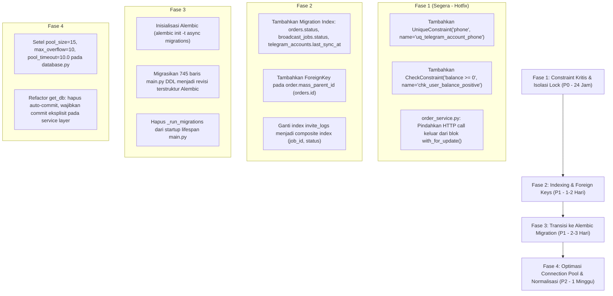

# Laporan Audit Mendalam: Arsitektur Basis Data (Database Audit) TeleBos

**Tanggal Audit:** 3 September 2026  
**Target:** Seluruh Arsitektur Database TeleBos (`PostgreSQL`, `SQLAlchemy 2.0 Async Engine`, `asyncpg`, `Alembic Migration Assessment`, `Constraint & Index Integrity`)  
**Metodologi:** Graphify Knowledge Graph Analysis (`graphify-out/graph.json`, 3.401 nodes, 6.795 edges) + Skema DDL Profiling + Transactional Boundary Analysis.

---

## Ringkasan Eksekutif & Matriks Kerentanan Basis Data

Audit menyeluruh terhadap layer persistensi data TeleBos menemukan **16 kelemahan struktural dan transaksional**. Temuan paling mendesak mencakup: **ketiadaan `UniqueConstraint` pada nomor telepon akun Telegram** (memungkinkan duplikasi akun pada race condition login), **ketiadaan `CheckConstraint` pada saldo user** (memungkinkan saldo bernilai negatif), **eksekusi panggilan HTTP eksternal di dalam row-level lock database**, **ketiadaan foreign key pada relasi penting**, serta **745 baris skrip migrasi raw SQL tanpa versioning Alembic**.

### Matriks 12 Dimensi Database

| Kategori Masalah | Tingkat Keparahan | Modul Terkait | Ringkasan Dampak |
| :--- | :---: | :--- | :--- |
| **1. Missing Constraints** | 🔴 **CRITICAL** | `models/telegram_account.py`, `models/user.py` | Tidak ada `UniqueConstraint("phone")` (akun ganda) dan tidak ada `CHECK(balance >= 0)` (saldo negatif). |
| **2. Database Race Condition** | 🔴 **CRITICAL** | `api/accounts.py`, `services/account_service.py` | Dua request login bersamaan untuk nomor HP yang sama berhasil membuat dua baris akun kembar (*split-brain*). |
| **3. Network I/O in DB Lock** | 🔴 **CRITICAL** | `services/order_service.py` | Row `User` dikunci dengan `with_for_update()`, lalu menjalankan HTTP call SMM selama 60 detik (mengunci user di seluruh sistem). |
| **4. Missing Foreign Keys** | 🟠 **HIGH** | `models/order.py`, `models/broadcast_job.py` | `mass_parent_id` tidak memiliki FK ke `orders.id`; `account_ids` disimpan sebagai JSONB tanpa FK ke `telegram_accounts`. |
| **5. Missing Indexes** | 🔴 **CRITICAL** | `models/order.py`, `models/broadcast_job.py` | `orders.status`, `orders.smm_order_id`, `broadcast_jobs.status`, dan `telegram_accounts.last_sync_at` tidak berindeks (Full Table Scan). |
| **6. Partial Update Hazard** | 🟠 **HIGH** | `database.py` (`get_db`) | `get_db` memanggil `await session.commit()` di blok exit. Error validasi yang ditangani di handler tetap ter-commit ke DB. |
| **7. Inconsistent Data** | 🟠 **HIGH** | `models/telegram_account.py`, `models/telegram_chat.py` | Statistik grup/channel di-cache di kolom `telegram_accounts`, bertentangan dengan data riil di `telegram_chats` hingga 24 jam. |
| **8. Data Duplication** | 🟡 **MEDIUM** | Tabel `"user"` (Better Auth) vs `users` (App) | Data user tersimpan di dua tabel berbeda dengan risiko desinkronisasi saat profil diubah. |
| **9. No Migration Strategy** | 🟠 **HIGH** | `backend/app/main.py:L250-L995` | Menggunakan 745 baris migrasi raw SQL manual tanpa Alembic/versioning, memicu race condition DDL pada multi-replica startup. |
| **10. Connection Pool Misconfig** | 🟠 **HIGH** | `backend/app/database.py` | `pool_size=20, max_overflow=30` (50 koneksi per worker) berisiko melebihi `max_connections` PostgreSQL tanpa `pool_timeout` eksplisit. |
| **11. Overly Complex Query** | 🟡 **MEDIUM** | `backend/app/api/admin.py` | Query admin broadcast (200 baris) melakukan in-memory conflict detection dan cross-referencing JSONB arrays secara manual. |
| **12. Wrong Index Usage** | 🟡 **MEDIUM** | `backend/app/models/invite_log.py` | Index hanya pada `(job_id, invited_at)`. Query filter status UI harus memindai seluruh baris job secara sekuensial. |

---

## 1. Ketiadaan Constraint & Integritas Relasional (Missing Constraints)

### 🚨 DBC-01: Ketiadaan Constraint Unik pada Nomor Telepon Akun Telegram
* **Lokasi Kode:** [`backend/app/models/telegram_account.py:L23`](file:///d:/PROJECT/Telegram/TeleBos/backend/app/models/telegram_account.py#L23)
* **Analisis Masalah:**  
  Kolom `phone` pada model `TelegramAccount`:
  ```python
  phone: Mapped[str] = mapped_column(String(20), nullable=False)
  ```
  Tabel `telegram_accounts` **SAMA SEKALI TIDAK MEMILIKI `unique=True` atau `UniqueConstraint("phone")`**.  
  Meskipun kode aplikasi melakukan pemeriksaan awal via:
  ```python
  acc_result = await db.execute(select(TelegramAccount).where(TelegramAccount.phone == phone))
  ```
  Pemeriksaan di level aplikasi tanpa constraint database tunduk pada *Time-of-Check to Time-of-Use (TOCTOU)*.
* **Skenario Masalah:**  
  Dua proses otorisasi (misal QR login yang terdeteksi bersamaan dengan submit OTP, atau koneksi ganda) dapat membaca `existing = None` secara bersamaan, dan keduanya mengeksekusi `db.add(TelegramAccount(phone=phone))`.
* **Dampak:**  
  Dua baris akun Telegram dengan nomor telepon identik tercipta di database. Background sync akan memperbarui salah satu akun sementara UI membaca akun lainnya (*split-brain state*).

---

### 🚨 DBC-02: Ketiadaan Check Constraint pada Saldo User (`balance >= 0`)
* **Lokasi Kode:** [`backend/app/models/user.py:L24`](file:///d:/PROJECT/Telegram/TeleBos/backend/app/models/user.py#L24)
* **Analisis Masalah:**  
  Definisi kolom saldo pada tabel `users`:
  ```python
  balance: Mapped[int] = mapped_column(default=0)
  ```
  Tidak ada `CheckConstraint("balance >= 0", name="chk_user_balance_non_negative")`.  
  Jika terjadi anomali logika pembatalan pesanan, perhitungan diskon ganda, atau kegagalan lock:
  Database PostgreSQL akan menerima nilai saldo negatif (misal: `-25000`). Pengguna yang saldonya negatif dapat terus menggunakan sistem jika endpoint tertentu hanya memeriksa `balance != 0`.

---

### 🟡 DBC-03: Ketiadaan Validasi Enum / Check Constraint pada Status
* **Lokasi Kode:** `models/order.py:L30`, `models/broadcast_job.py:L41`, `models/invite_job.py:L41`
* **Analisis Masalah:**  
  Kolom status pada tabel `orders`, `broadcast_jobs`, dan `invite_jobs` didefinisikan sebagai string polos (`String(20)` / `String(50)`). Tidak ada tipe PostgreSQL `ENUM` maupun `CheckConstraint("status IN ('pending', 'running', ...)")`. Nilai status liar (typo) dapat terinput dan menyebabkan background worker menggantung selamanya.

---

## 2. Race Condition pada Database (Database Race Conditions)

### 🚨 DBR-01: Network I/O di dalam Row Lock Database (`order_service.py`)
* **Lokasi Kode:** [`backend/app/services/order_service.py:L136-L154`](file:///d:/PROJECT/Telegram/TeleBos/backend/app/services/order_service.py#L136-L154)
* **Analisis Masalah:**  
  Perhatikan urutan eksekusi pada `place_order`:
  ```python
  # 1. Mengunci baris user secara eksklusif
  locked_user_result = await db.execute(
      select(User).where(User.id == user.id).with_for_update()
  )
  user = locked_user_result.scalar_one()

  # 2. EKSEKUSI HTTP CALL EKSTERNAL DALAM KEADAAN BARIS DATABASE TERKUNCI!
  result = await create_order(service_id, data_target, quantity, comments, usernames)
  ```
  Fungsi `create_order` melakukan HTTP POST ke API BuzzerPanel dengan batas timeout **60.0 detik**.  
  Selama request jaringan ini berjalan:
  Baris user di tabel `users` **TERKUNCI PENUH (*EXCLUSIVE WRITE LOCK*)** di PostgreSQL.
* **Dampak:**  
  1. Semua request lain dari user tersebut (membuka dashboard, mengirim chat, mengecek status) akan terhenti membeku menunggu baris lock dilepas.
  2. Jika koneksi HTTP timeout setelah API pihak ketiga memproses pesanan, transaksi database ter-rollback: **saldo user tidak berkurang, tetapi pesanan telah terbuat di panel pihak ketiga** (*inconsistency exploit*).

---

## 3. Ketiadaan Foreign Key (Missing Foreign Keys)

### 🟠 DBF-01: `mass_parent_id` Tanpa Foreign Key Constraint
* **Lokasi Kode:** [`backend/app/models/order.py:L34`](file:///d:/PROJECT/Telegram/TeleBos/backend/app/models/order.py#L34)
* **Analisis Masalah:**  
  ```python
  mass_parent_id: Mapped[uuid.UUID | None] = mapped_column(UUID(as_uuid=True), nullable=True)
  ```
  Kolom relasi ke parent order ini **tidak memiliki `ForeignKey("orders.id", ondelete="CASCADE")`**.  
  Jika parent order dihapus atau dibatalkan oleh admin, baris-baris child mass order menjadi baris yatim (*orphaned records*) yang merujuk pada UUID yang tidak ada.

---

### 🟠 DBF-02: Akumulasi UUID Akun dalam JSONB Tanpa Relational Integrity
* **Lokasi Kode:**
  * [`backend/app/models/broadcast_job.py:L25`](file:///d:/PROJECT/Telegram/TeleBos/backend/app/models/broadcast_job.py#L25) (`account_ids: JSONB`)
  * [`backend/app/models/invite_job.py:L25`](file:///d:/PROJECT/Telegram/TeleBos/backend/app/models/invite_job.py#L25) (`account_ids: JSONB`)
* **Analisis Masalah:**  
  Daftar akun pelaksana job disimpan sebagai array string di dalam kolom JSONB: `["uuid-1", "uuid-2"]`.  
  Karena bukan tabel relasi many-to-many (`broadcast_job_accounts`), **tidak ada Foreign Key ke `telegram_accounts.id`**. Ketika sebuah akun Telegram dihapus permanen oleh pengguna, UUID-nya tetap tertinggal di dalam JSONB job yang sedang antre atau berjalan, memicu crash runtime saat worker mencoba memuat akun tersebut.

---

## 4. Indeks Hilang & Indeks Salah (Missing & Wrong Indexes)

### 🚨 DBI-01: Full Table Scan Kolom-kolom Polling Rutin
Kolom-kolom berikut di-query secara periodik tinggi oleh background worker namun **tidak memiliki index**:

1. **`orders.status` & `orders.smm_order_id`** ([`models/order.py:L22, L30`](file:///d:/PROJECT/Telegram/TeleBos/backend/app/models/order.py#L22)):
   Di-query setiap 60 detik oleh `admin_smm_service.py`:
   ```sql
   SELECT * FROM orders WHERE status IN ('Pending', 'Processing', 'Partial', 'In progress');
   ```
   PostgreSQL melakukan *Full Table Scan* setiap 60 detik.
2. **`broadcast_jobs.status`** ([`models/broadcast_job.py:L41`](file:///d:/PROJECT/Telegram/TeleBos/backend/app/models/broadcast_job.py#L41)):
   Di-query setiap 60 detik saat idle client cleanup.
3. **`telegram_accounts.last_sync_at`** ([`models/telegram_account.py:L66`](file:///d:/PROJECT/Telegram/TeleBos/backend/app/models/telegram_account.py#L66)):
   Di-query dan di-sort **setiap 15 detik** di `main.py:_adaptive_sequential_sync_loop`:
   ```sql
   SELECT * FROM telegram_accounts WHERE is_active = true ORDER BY last_sync_at ASC NULLS FIRST LIMIT 1;
   ```
   Ketiadaan index pada `last_sync_at` memaksa PostgreSQL melakukan *Sequential Scan + In-Memory Sort* 4 kali setiap menit!

---

### 🟡 DBI-02: Index Suboptimal pada Tabel `invite_logs`
* **Lokasi Kode:** [`backend/app/models/invite_log.py:L16-L18`](file:///d:/PROJECT/Telegram/TeleBos/backend/app/models/invite_log.py#L16-L18)
* **Analisis Masalah:**  
  Index yang tersedia hanya `Index("ix_invite_logs_job_invited", "job_id", "invited_at")`.  
  Namun, antarmuka pengguna (UI) selalu memfilter log berdasarkan status (`WHERE job_id = ... AND status = 'error'`). Ketiadaan composite index pada `(job_id, status)` memaksa database memindai seluruh log job sebelum memfilter status di memori.

---

## 5. Transaksi Hilang & Partial Update (Missing Transactions)

### 🟠 DBT-01: Bahaya Auto-Commit pada Dependensi `get_db`
* **Lokasi Kode:** [`backend/app/database.py:L29-L37`](file:///d:/PROJECT/Telegram/TeleBos/backend/app/database.py#L29-L37)
* **Analisis Masalah:**  
  ```python
  async def get_db() -> AsyncSession:
      async with async_session_factory() as session:
          try:
              yield session
              await session.commit()
          except Exception:
              await session.rollback()
              raise
  ```
  Blok `get_db` mengeksekusi `await session.commit()` secara otomatis ketika coroutine endpoint selesai.  
  Jika di dalam endpoint developer melakukan mutasi parsial:
  ```python
  db.add(entity)
  await db.flush()
  # Jika validasi bisnis gagal dan ditangkap oleh try/except lokal yang mengembalikan JSONResponse(400)
  ```
  Karena tidak ada exception yang lolos keluar dari fungsi route, `get_db` menganggap request sukses dan **mengeksekusi `commit()` terhadap data parsial tersebut**.

---

## 6. Duplikasi & Inkonsistensi Data (Inconsistent Data)

### 🟠 DBD-01: Dual-Table User Duplication (Better Auth `user` vs App `users`)
* **Lokasi Kode:** [`backend/app/dependencies.py:L50-L55, L84-L95`](file:///d:/PROJECT/Telegram/TeleBos/backend/app/dependencies.py#L50-L55)
* **Analisis Masalah:**  
  Sistem memiliki dua tabel user:
  1. Tabel `"user"` (dikelola oleh Better Auth): menyimpan `name`, `email`, `emailVerified`.
  2. Tabel `users` (dikelola oleh aplikasi TeleBos): menyimpan `role`, `balance`, `subscription_expires_at`.  
  Jika email atau nama diubah pada Better Auth, tabel `users` tidak otomatis terbarui kecuali ada trigger atau sinkronisasi dua arah.

---

### 🟠 DBD-02: Sinkronisasi Tertunda pada Statistik Akun
* **Lokasi Kode:** [`backend/app/models/telegram_account.py:L72-L76`](file:///d:/PROJECT/Telegram/TeleBos/backend/app/models/telegram_account.py#L72-L76)
* **Analisis Masalah:**  
  Kolom `total_groups`, `owned_groups`, `total_channels`, dan `owned_channels` disimpan langsung di `telegram_accounts`. Namun, percakapan riil diperbarui secara real-time di tabel `telegram_chats`. Kolom statistik di `telegram_accounts` hanya diperbarui satu kali sehari oleh task background, menyebabkan data yang ditampilkan di UI akun tidak sinkron dengan daftar chat riil.

---

## 7. Ketiadaan Strategi Migrasi (No Migration Strategy)

### 🟠 DBM-01: 745 Baris Migrasi Raw SQL Spaghetti di Startup
* **Lokasi Kode:** [`backend/app/main.py:L250-L995`](file:///d:/PROJECT/Telegram/TeleBos/backend/app/main.py#L250-L995) (`_run_migrations`)
* **Analisis Masalah:**  
  Aplikasi tidak menggunakan framework migrasi standar industri seperti **Alembic**.  
  Sebaliknya, pada setiap startup server, fungsi `_run_migrations` menjalankan ratusan baris kode imperatif:
  ```python
  if "spam_detail" not in acct_cols:
      connection.execute(text("ALTER TABLE telegram_accounts ADD COLUMN spam_detail TEXT DEFAULT NULL"))
  ```
* **Risiko Struktural:**  
  1. **Tidak Ada Versioning:** Tidak ada tabel `alembic_version` yang melacak revisi database.
  2. **Tidak Ada Rollback:** Flawed migration tidak dapat di-downgrade secara otomatis.
  3. **DDL Race Condition pada Multi-Worker:** Jika TeleBos dijalankan dengan multiple worker atau container Docker paralel, semua container akan mengeksekusi `ALTER TABLE` secara bersamaan saat boot, memicu deadlock DDL (`lock_timeout`).

---

## 8. Konfigurasi Connection Pool Salah (Connection Pool Misconfiguration)

### 🟠 DBP-01: Risiko Port Exhaustion & Starvation pada Connection Pool
* **Lokasi Kode:** [`backend/app/database.py:L9-L16`](file:///d:/PROJECT/Telegram/TeleBos/backend/app/database.py#L9-L16)
* **Analisis Masalah:**  
  ```python
  engine = create_async_engine(
      settings.DATABASE_URL,
      pool_size=20,
      max_overflow=30,
      pool_recycle=1800,
      pool_pre_ping=True,
  )
  ```
  1. `max_overflow=30` memungkinkan hingga **50 koneksi aktif per proses**. Jika backend dijalankan dengan Uvicorn multi-worker (misal 3 worker), total koneksi dapat mencapai 150, melebihi kapasitas default PostgreSQL (`max_connections = 100`).
  2. Parameter `pool_timeout` tidak dikonfigurasi secara eksplisit (default 30 detik). Jika pool terkuras akibat koneksi yang ditahan saat sleep di `invite_service.py`, coroutine baru akan tertahan selama 30 detik sebelum melempar error timeout.

---

## Roadmap Remediasi Basis Data Terstruktur



---
*Laporan audit database ini disusun berdasarkan inspeksi skema AST, analisis transaksional, dan integritas relasional TeleBos.*
