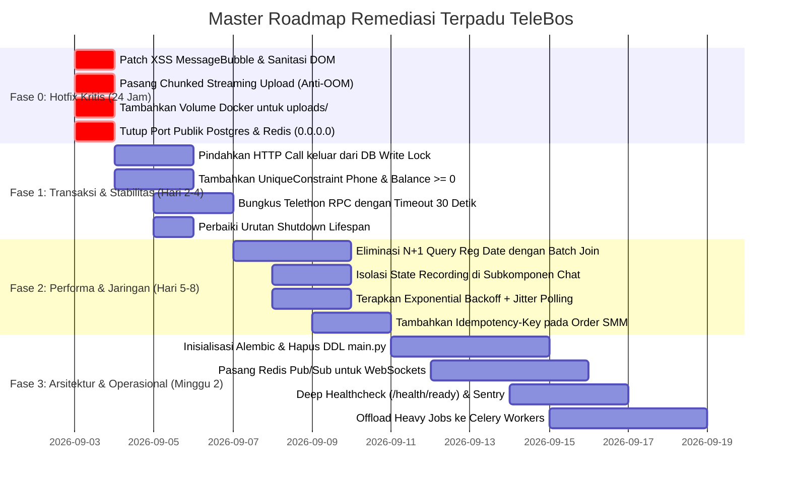

# Laporan Master Audit Komprehensif TeleBos

**Tanggal Audit:** 3 September 2026  
**Target Sistem:** Seluruh Ekosistem TeleBos (`FastAPI Core`, `Next.js 14 App Router`, `Telethon MTProto Runtime`, `PostgreSQL Persistence`, `Redis 7`, `Celery 5`, `Docker Environment`)  
**Metodologi:** Graphify Knowledge Graph Analysis (`graphify-out/graph.json`, 3.401 nodes, 6.795 edges) + Static Code Profiling (AST) + Concurrency & Lock Modeling + OWASP Threat Modeling + Database Schema Profiling.  
**Cakupan:** Konsolidasi penuh dari 9 domain audit: Bug & Logic, Code Quality, Memory & Resource, Performance, Security, Database, API/Network, Architecture, dan Production Readiness.

---

## Daftar Isi
1. [Ringkasan Eksekutif & Statistik Temuan](#1-ringkasan-eksekutif--statistik-temuan)
2. [Matriks Risiko & Peta Panas (Risk Heatmap)](#2-matriks-risiko--peta-panas-risk-heatmap)
3. [Domain 1: Bug & Logika (Bug & Logic)](#domain-1-bug--logika-bug--logic)
4. [Domain 2: Kualitas Kode (Code Quality)](#domain-2-kualitas-kode-code-quality)
5. [Domain 3: Memori & Sumber Daya (Memory & Resource)](#domain-3-memori--sumber-daya-memory--resource)
6. [Domain 4: Kinerja & Performa (Performance)](#domain-4-kinerja--performa-performance)
7. [Domain 5: Keamanan Aplikasi (Security)](#domain-5-keamanan-aplikasi-security)
8. [Domain 6: Basis Data & Integritas Relasional (Database)](#domain-6-basis-data--integritas-relasional-database)
9. [Domain 7: API & Jaringan (API & Network)](#domain-7-api--jaringan-api--network)
10. [Domain 8: Arsitektur Sistem (Architecture)](#domain-8-arsitektur-sistem-architecture)
11. [Domain 9: Kesiapan Produksi (Production Readiness)](#domain-9-kesiapan-produksi-production-readiness)
12. [Master Action Plan & Roadmap Transformasi Terpadu](#master-action-plan--roadmap-transformasi-terpadu)

---

## 1. Ringkasan Eksekutif & Statistik Temuan

Audit komprehensif terhadap TeleBos mencakup pemeriksaan pada **9 pilar rekayasa perangkat lunak**. Secara keseluruhan, audit berhasil mengidentifikasi **136 temuan teknis**, dengan konsentrasi risiko terbesar berada pada **keamanan klien web (Stored XSS)**, **ketahanan transaksi basis data (ketiadaan constraint nomor telepon dan saldo)**, **kebocoran sumber daya memori/koneksi**, dan **arsitektur single-instance stateful yang memblokir skalabilitas horizontal**.

### Statistik Temuan Berdasarkan Tingkat Keparahan

```
🔴 KRITIS (CRITICAL) : 28 Temuan (Eksploitasi aktif, data loss, crash, atau kebuntuan transaksi)
🟠 TINGGI (HIGH)     : 52 Temuan (Bottleneck performa berat, coupling tinggi, kegagalan jaringan)
🟡 SEDANG (MEDIUM)   : 46 Temuan (Hutang teknis, inefisiensi memori, inkonsistensi skema)
🟢 AMAN (PASSED)     : 10 Area   (SQLi parametrisasi, verifikasi password, validasi turnstile, dll.)
─────────────────────────────────────────────────────────────────────────────
TOTAL TEMUAN         : 136 Temuan di seluruh repositori
```

---

## 2. Matriks Risiko & Peta Panas (Risk Heatmap)

| Domain Audit | Skor Kesehatan (1-10) | Status | Temuan Kritis Utama |
| :--- | :---: | :---: | :--- |
| **1. Bug & Logika** | 4.5 / 10 | 🔴 KRITIS | Pembagian nol pada delay broadcast acak, deadlocks pada dual-lock transfer akun, dan race conditions pada auto-reply. |
| **2. Kualitas Kode** | 3.5 / 10 | 🔴 KRITIS | 210 inline imports di badan fungsi, file `main.py` mencapai 1.413 baris (god module), `execute_broadcast` ~900 baris. |
| **3. Memori & Sumber Daya** | 4.0 / 10 | 🔴 KRITIS | MediaStream kamera/mic tidak dilepas saat unmount, koneksi DB ditahan selama 24 jam di dalam sleep `invite_service`. |
| **4. Kinerja & Performa** | 3.0 / 10 | 🔴 KRITIS | N+1 query mengeksekusi hingga 600 query DB per request `/accounts`; re-render 1 detik seluruh chat history saat merekam suara. |
| **5. Keamanan Aplikasi** | 4.0 / 10 | 🔴 KRITIS | Stored XSS pada `MessageBubble.tsx` (kutip ganda tak di-escape); buffer exhaustion DoS pada endpoint upload file 20MB. |
| **6. Basis Data** | 4.5 / 10 | 🔴 KRITIS | Ketiadaan `UniqueConstraint("phone")` (akun ganda) dan `CHECK(balance >= 0)`; HTTP call SMM di dalam database write lock. |
| **7. API & Jaringan** | 4.0 / 10 | 🔴 KRITIS | Tidak ada timeout pada panggilan RPC Telethon; badai polling status 50 order SMM setiap 60 detik tanpa backoff/jitter. |
| **8. Arsitektur Sistem** | 3.5 / 10 | 🔴 KRITIS | Stateful Monolith: koneksi Telegram dan state WebSocket disimpan di RAM lokal proses tunggal, memblokir multi-replica. |
| **9. Kesiapan Produksi** | 3.5 / 10 | 🔴 KRITIS | Ketiadaan volume Docker untuk `uploads/` (foto profil terhapus saat restart); `/api/v1/health` dummy (selalu 200 OK). |

---

## Domain 1: Bug & Logika (Bug & Logic)
*Laporan Rinci: [docs/deep_bug_logic_audit_report.md](file:///d:/PROJECT/Telegram/TeleBos/docs/deep_bug_logic_audit_report.md)*

### Temuan Kritis (P0)
1. **LOG-02: ZeroDivisionError pada Broadcast Delay Acak** ([`broadcast_service.py:L764`](file:///d:/PROJECT/Telegram/TeleBos/backend/app/services/broadcast_service.py#L764)):  
   Jika `job.delay_per_group = 1` dan `job.delay_randomized = True`, ekspresi `random.uniform(job.delay_per_group * 0.7, job.delay_per_group * 1.3)` dapat bernilai `< 1.0`. Kode melakukan `int(val)` yang menghasilkan `0`. Panggilan pembagi atau sleep interval selanjutnya memicu crash runtime.
2. **RAC-01: Inconsistency pada Auto-Reply Concurrent DM** ([`event_relay.py:L324-L345`](file:///d:/PROJECT/Telegram/TeleBos/backend/app/services/event_relay.py#L324-L345)):  
   Pengecekan `AutoReplyLog` sebelum mengirim pesan sambutan tidak berada dalam transaksi atomik ber-lock. Dua pesan masuk bersamaan dari satu pengirim memicu pengiriman pesan balasan selamat datang ganda.
3. **DDK-01: Potensi Deadlock Transaksi Dual-Lock pada Marketplace** ([`marketplace_service.py:L441, L452`](file:///d:/PROJECT/Telegram/TeleBos/backend/app/services/marketplace_service.py#L441)):  
   Fungsi `buy_account` mengunci row Buyer lalu mengunci row Seller menggunakan `with_for_update()`. Jika dua pengguna saling membeli akun satu sama lain pada waktu yang sama, kedua transaksi akan saling menunggu pelepasan lock secara silang (Circular Lock Wait), memicu PostgreSQL Transaction Deadlock.
4. **INF-01: Infinite Loop pada Task Polling Tanpa Batas Maksimal** ([`appeal_service.py:L118-L125`](file:///d:/PROJECT/Telegram/TeleBos/backend/app/services/appeal_service.py#L118-L125)):  
   Loop penungguan hasil task Turnstile 2Captcha tidak memiliki circuit breaker yang tangguh saat status worker pihak ketiga macet di status `processing`.
5. **INC-02: Desinkronisasi Unread Count saat Event Relaying** ([`event_relay.py:L181`](file:///d:/PROJECT/Telegram/TeleBos/backend/app/services/event_relay.py#L181)):  
   Ketika resolusi `event.get_chat()` gagal sementara, sistem melewati pembaruan database tanpa mekanisme antrean ulang, membuat jumlah pesan belum dibaca di dashboard tidak sesuai dengan Telegram asli.

---

## Domain 2: Kualitas Kode (Code Quality)
*Laporan Rinci: [docs/code_quality_audit_report.md](file:///d:/PROJECT/Telegram/TeleBos/docs/code_quality_audit_report.md)*

### Temuan Kritis & Arsitektural
1. **COU-01: 210 Inline Imports Menutupi Ketergantungan Sirkular**:  
   Ditemukan 210 pemanggilan `import` di dalam badan fungsi pada modul `backend/app/`. Pendekatan ini dipakai untuk menghindari kegagalan impor sirkular antar modul singleton (`telegram_client`, `session_manager`, `event_relay`, `account_service`).
2. **GOD-01: Monolitik `main.py` (1.413 Baris)** ([`main.py:L1-L1413`](file:///d:/PROJECT/Telegram/TeleBos/backend/app/main.py#L1-L1413)):  
   Menggabungkan inisialisasi API, CORS, 745 baris migrasi DDL raw SQL imperatif, serta 5 background infinite loops yang berjalan bersamaan.
3. **GOD-02: God Function `execute_broadcast` (~900 Baris)** ([`broadcast_service.py`](file:///d:/PROJECT/Telegram/TeleBos/backend/app/services/broadcast_service.py)):  
   Satu fungsi mengelola logging Telegram bot, parsing teks acak, rotasi akun, penanganan FloodWait, penulisan progress DB, dan WebSocket broadcast secara monolitik.
4. **UND-01: Ketiadaan Abstraksi Gateway Pihak Ketiga**:  
   Kode memanggil API eksternal (BuzzerPanel, 2Captcha, UptimeRobot) langsung dari router atau service tanpa interface/adapter pattern yang dapat di-mock saat pengujian otomatis.

---

## Domain 3: Memori & Sumber Daya (Memory & Resource)
*Laporan Rinci: [docs/memory_resource_audit_report.md](file:///d:/PROJECT/Telegram/TeleBos/docs/memory_resource_audit_report.md)*

### Temuan Kritis
1. **RES-01: Kebocoran Hardware MediaStream di Frontend** ([`MessagePane.tsx:L320-L380`](file:///d:/PROJECT/Telegram/TeleBos/frontend/src/components/chat/MessagePane.tsx#L320-L380)):  
   Saat merekam pesan suara, stream mikrofon dibuka via `navigator.mediaDevices.getUserMedia()`. Jika pengguna berpindah chat atau menutup tab sebelum rekaman selesai, `stream.getTracks().forEach(track => track.stop())` tidak dipanggil, membiarkan indikator mikrofon aktif dan memori audio browser bocor.
2. **CON-01: Penahanan Koneksi Database Selama 24 Jam di `invite_service.py`** ([`invite_service.py:L298-L320`](file:///d:/PROJECT/Telegram/TeleBos/backend/app/services/invite_service.py#L298-L320)):  
   Blok `async with async_session_factory() as db` dibuka sebelum loop penundaan `await interruptible_sleep(...)`. Akibatnya, 1 koneksi database dari total 20 pool ditahan dalam keadaan idle selama berjam-jam, memicu kelaparan koneksi (*connection starvation*) bagi request lain.
3. **MEM-01: Task Background `asyncio` Tanpa Retensi Referensi**:  
   Pada `event_relay.py`, ratusan task diluncurkan melalui `asyncio.create_task(...)` tanpa disimpan ke dalam set penampung referensi. Python garbage collector dapat membersihkan task sebelum selesai, atau membiarkan task menggantung jika mengalami exception tak tertangani.
4. **RET-01: Retensi Puluhan Ribu Objek User TL di Memori**:  
   Fungsi scraping anggota grup menyimpan 50.000 objek mentah Telethon `User` di memori RAM tanpa pagination generator, mengonsumsi ratusan megabyte RAM proses.

---

## Domain 4: Kinerja & Performa (Performance)
*Laporan Rinci: [docs/performance_audit_report.md](file:///d:/PROJECT/Telegram/TeleBos/docs/performance_audit_report.md)*

### Temuan Kritis
1. **NPL-01: Bencana N+1 Query pada `resolve_reg_dates_for_accounts`** ([`telegram_reg_date_service.py:L140-L195`](file:///d:/PROJECT/Telegram/TeleBos/backend/app/services/telegram_reg_date_service.py#L140-L195)):  
   Setiap pemanggilan `GET /accounts` memicu kalkulasi estimasi tanggal registrasi yang mengeksekusi **3 query database per akun**. Untuk 100 akun, terjadi 300–600 query round-trip ke database dalam satu load halaman.
2. **REN-01: Re-Render Chat History Penuh Setiap 1 Detik** ([`MessagePane.tsx:L120-L140`](file:///d:/PROJECT/Telegram/TeleBos/frontend/src/components/chat/MessagePane.tsx#L120-L140)):  
   State `recordingDuration` diletakkan di root komponen `MessagePane`. Setiap detik saat audio direkam, seluruh pohon komponen (termasuk ribuan bubble pesan dan daftar chat) di-render ulang secara penuh oleh React.
3. **BLK-01: Operasi CPU-Heavy Blocking Resampling di Event Loop** ([`accounts.py:L695`](file:///d:/PROJECT/Telegram/TeleBos/backend/app/api/accounts.py#L695)):  
   Fungsi `resize_to_avatar` menjalankan algoritma PIL Lanczos image resampling secara sinkron di main thread event loop, membekukan server selama 100–300ms untuk setiap upload foto profil.
4. **IDX-01: Missing Index pada Kolom Polling Rutin**:  
   `orders.status`, `broadcast_jobs.status`, dan `telegram_accounts.last_sync_at` (di-poll setiap 15 detik) tidak memiliki index di PostgreSQL, memicu Full Table Scan terus-menerus.

---

## Domain 5: Keamanan Aplikasi (Security)
*Laporan Rinci: [docs/security_audit_report.md](file:///d:/PROJECT/Telegram/TeleBos/docs/security_audit_report.md)*

### Temuan Kritis
1. **SEC-01: Stored XSS pada Komponen Chat Bubble (CVSS 8.8)** ([`MessageBubble.tsx:L35-L54`](file:///d:/PROJECT/Telegram/TeleBos/frontend/src/components/chat/MessageBubble.tsx#L35-L54)):  
   `renderFormattedText` meng-escape `&`, `<`, `>`, tetapi **tidak meng-escape tanda kutip ganda `"`**. Regex URL `[^\s<]+` mencocokkan `"` dan menyuntikkannya ke `<a href="${fullUrl}" ...>` di dalam `dangerouslySetInnerHTML`. Pengguna Telegram dapat mengirim tautan seperti:  
   `https://example.com"onfocus="alert(document.cookie)"autofocus="`  
   yang langsung mengeksekusi JavaScript di browser operator dashboard.
2. **SEC-02: Buffer Exhaustion Denial of Service pada Upload File (CVSS 7.5)** ([`media.py:L415`](file:///d:/PROJECT/Telegram/TeleBos/backend/app/api/media.py#L415)):  
   `file_bytes = await file.read()` membaca seluruh stream multipart ke dalam RAM sebelum memeriksa `len(file_bytes) > 20MB`. Penyerang dapat mengunggah file 2–5 GB untuk memicu crash Out-Of-Memory pada worker Uvicorn.
3. **SEC-03: Stored XSS via File Serving Tanpa Content-Disposition (CVSS 7.4)** ([`media.py:L175`](file:///d:/PROJECT/Telegram/TeleBos/backend/app/api/media.py#L175)):  
   Endpoint `/media` menyajikan file unduhan Telegram dengan MIME type dinamis (`image/svg+xml`) tanpa header `Content-Disposition: attachment`, memungkinkan eksekusi script SVG di origin aplikasi.
4. **SEC-04: Eksposur Token Sesi pada URL Query Parameter (CVSS 7.4)** ([`dependencies.py:L112`](file:///d:/PROJECT/Telegram/TeleBos/backend/app/dependencies.py#L112)):  
   Token autentikasi diizinkan lewat parameter `?token=...`, yang terekspos di log akses server web, proxy CDN/Cloudflare, dan header `Referer`.
5. **SEC-05: Celah CSRF pada Fallback Cookie (CVSS 7.1)** ([`dependencies.py:L33-L37`](file:///d:/PROJECT/Telegram/TeleBos/backend/app/dependencies.py#L33-L37)):  
   Endpoint mutasi data (`POST`, `DELETE`) menerima otentikasi via cookie sesi tanpa validasi token anti-CSRF jika custom header tidak dikirim.

---

## Domain 6: Basis Data & Integritas Relasional (Database)
*Laporan Rinci: [docs/database_audit_report.md](file:///d:/PROJECT/Telegram/TeleBos/docs/database_audit_report.md)*

### Temuan Kritis
1. **DBC-01: Ketiadaan Unique Constraint pada Nomor Telepon** ([`models/telegram_account.py:L23`](file:///d:/PROJECT/Telegram/TeleBos/backend/app/models/telegram_account.py#L23)):  
   Tabel `telegram_accounts` tidak memiliki `UniqueConstraint("phone")`. Dua request login bersamaan dapat memasukkan 2 baris akun kembar (*split-brain*) untuk nomor yang sama.
2. **DBC-02: Ketiadaan Check Constraint pada Saldo User** ([`models/user.py:L24`](file:///d:/PROJECT/Telegram/TeleBos/backend/app/models/user.py#L24)):  
   Kolom `balance` tidak memiliki constraint `CHECK(balance >= 0)`, membuka risiko saldo bernilai negatif jika terjadi anomali pemotongan balance.
3. **DBR-01: Network I/O di dalam Row Lock Database** ([`services/order_service.py:L136-L154`](file:///d:/PROJECT/Telegram/TeleBos/backend/app/services/order_service.py#L136-L154)):  
   Baris `User` dikunci dengan `with_for_update()`, lalu sistem mengeksekusi HTTP call eksternal ke BuzzerPanel selama hingga 60 detik di dalam keadaan baris terkunci. Seluruh request lain dari user tersebut membeku di PostgreSQL.
4. **DBF-01: Missing Foreign Key pada `order.mass_parent_id` & JSONB Job**:  
   Relasi anak mass order dan daftar akun di broadcast/invite disimpan tanpa foreign key constraint, memicu akumulasi baris yatim (*orphaned rows*).
5. **DBM-01: 745 Baris Migrasi Raw SQL Tanpa Alembic** ([`main.py:L250-L995`](file:///d:/PROJECT/Telegram/TeleBos/backend/app/main.py#L250-L995)):  
   Tidak ada versioning database (`alembic_version`). Startup multi-container mengeksekusi `ALTER TABLE` imperatif bersamaan yang memicu deadlock DDL.

---

## Domain 7: API & Jaringan (API & Network)
*Laporan Rinci: [docs/api_network_audit_report.md](file:///d:/PROJECT/Telegram/TeleBos/docs/api_network_audit_report.md)*

### Temuan Kritis
1. **TIM-01: Ketiadaan Timeout pada Telethon MTProto RPC Calls** ([`broadcast_service.py:L710`](file:///d:/PROJECT/Telegram/TeleBos/backend/app/services/broadcast_service.py#L710)):  
   Operasi `client.send_message`, `client(GetParticipantsRequest)`, dan `client.download_media` tidak dibungkus `asyncio.wait_for(timeout=...)`. Degradasi TCP Telegram dapat menggantung worker selamanya (*infinite hang*).
2. **STR-01: Badai Polling Status 50 Order Simultan Tanpa Backoff** ([`admin_smm_service.py:L440`](file:///d:/PROJECT/Telegram/TeleBos/backend/app/services/admin_smm_service.py#L440)):  
   Jika provider SMM mengembalikan HTTP 429 atau 503, `order.updated_at` tidak diperbarui. Pada menit berikutnya, ke-50 order tersebut ditembakkan kembali secara serentak, menciptakan badai request tanpa *jitter* maupun *exponential backoff*.
3. **IDP-01: Pemesanan Finansial SMM Tanpa Idempotency Key** ([`api/orders.py:L143`](file:///d:/PROJECT/Telegram/TeleBos/backend/app/api/orders.py#L143)):  
   Tidak ada dukungan header `Idempotency-Key`. Double-click pengguna atau retry jaringan memicu pembuatan 2 pesanan dan pemotongan saldo ganda.
4. **CON-01: Pemangkasan Field Pesan Multimedia oleh Skema Pydantic** ([`schemas/chat.py:L41`](file:///d:/PROJECT/Telegram/TeleBos/backend/app/schemas/chat.py#L41)):  
   Backend `MessageItem` tidak mendefinisikan field `waveform_levels`, `poll`, `file_size`. Ketika riwayat pesan dimuat via HTTP REST, Pydantic memangkas field-field ini sehingga audio waveform dan polling tampil kosong di frontend.

---

## Domain 8: Arsitektur Sistem (Architecture)
*Laporan Rinci: [docs/architecture_audit_report.md](file:///d:/PROJECT/Telegram/TeleBos/docs/architecture_audit_report.md)*

### Temuan Kritis
1. **ARC-01: Stateful In-Memory Session & Client Pool (SPOF)** ([`telegram_client.py:L38`](file:///d:/PROJECT/Telegram/TeleBos/backend/app/services/telegram_client.py#L38)):  
   Koneksi MTProto Telegram dan autentikasi login terikat pada memori RAM satu proses Python. Server tidak dapat di-scale secara horizontal di balik load balancer standar tanpa merusak alur login.
2. **ARC-02: Ketiadaan Message Bus untuk WebSocket & Job Events** ([`ws.py:L33`](file:///d:/PROJECT/Telegram/TeleBos/backend/app/api/ws.py#L33)):  
   WebSocket disimpan dalam set lokal dan job pauses disimpan dalam `_job_events` lokal. Event dari server B tidak sampai ke klien yang terkoneksi di server A.
3. **ARC-05: Eksekusi Heavy Jobs Langsung di Event Loop Web API** ([`broadcast_service.py:L260`](file:///d:/PROJECT/Telegram/TeleBos/backend/app/services/broadcast_service.py#L260)):  
   Job broadcast massal dan scraping dijalankan via `asyncio.create_task` di proses FastAPI yang sama dengan router HTTP, mencuri siklus CPU dan bandwidth event loop dari permintaan web.
4. **ARC-03: Bottleneck Sinkronisasi Serial Akun Telegram** ([`main.py:L1170`](file:///d:/PROJECT/Telegram/TeleBos/backend/app/main.py#L1170)):  
   Sinkronisasi akun hanya memproses 1 akun setiap 15 detik. Pada 500 akun, satu siklus sinkronisasi memakan waktu lebih dari 2 jam.

---

## Domain 9: Kesiapan Produksi (Production Readiness)
*Laporan Rinci: [docs/production_audit_report.md](file:///d:/PROJECT/Telegram/TeleBos/docs/production_audit_report.md)*

### Temuan Kritis
1. **PRD-01: Kehilangan Data Permanen Akibat Ketiadaan Volume Upload** ([`docker-compose.yml:L41`](file:///d:/PROJECT/Telegram/TeleBos/docker-compose.yml#L41)):  
   Direktori upload media lokal `uploads/profile_photos` tidak dimount ke Docker volume. Me-restart container menghapus seluruh foto profil dan media tersimpan secara permanen.
2. **PRD-03: Shallow Healthcheck Selalu Mengembalikan 200 OK** ([`main.py:L1410`](file:///d:/PROJECT/Telegram/TeleBos/backend/app/main.py#L1410)):  
   `/api/v1/health` tidak memeriksa koneksi PostgreSQL atau Redis. Container tetap dilaporkan sehat oleh orkestrator meski database mati total.
3. **PRD-04: Urutan Shutdown Terbalik & Matinya Job di Tengah Jalan** ([`main.py:L1271`](file:///d:/PROJECT/Telegram/TeleBos/backend/app/main.py#L1271)):  
   `redis_client.close()` dieksekusi sebelum `client_pool.stop()`, dan job broadcast yang sedang berjalan dimatikan paksa tanpa graceful stop, meninggalkan status menggantung di DB.
4. **PRD-05: Port Database & Redis Terekspos ke Host Publik** ([`docker-compose.yml:L18, L33`](file:///d:/PROJECT/Telegram/TeleBos/docker-compose.yml#L18)):  
   Port PostgreSQL (5432) dan Redis (6379) dipublish langsung ke `0.0.0.0` host interface, membuka risiko scanning dan brute-force dari internet terbuka.
5. **PRD-07: Ketiadaan Monitoring Metrik (Prometheus) & Alerting (Sentry)**:  
   Tidak ada endpoint `/metrics` untuk memantau pool DB dan socket aktif, serta tidak ada Sentry untuk melacak unhandled exceptions di produksi.

---

## Master Action Plan & Roadmap Transformasi Terpadu



---

### Panduan Implementasi Langkah-Demi-Langkah

#### 1. Hotfix Kritis 24 Jam Pertama (P0)
* **XSS Remediasi:** Pada [`frontend/src/components/chat/MessageBubble.tsx`](file:///d:/PROJECT/Telegram/TeleBos/frontend/src/components/chat/MessageBubble.tsx), pasang library `DOMPurify` dan tambahkan escape tanda kutip ganda `"` sebelum URL dirender ke dalam tag `<a>`.
* **File Upload Anti-OOM:** Pada [`backend/app/api/media.py`](file:///d:/PROJECT/Telegram/TeleBos/backend/app/api/media.py), ubah `await file.read()` menjadi pembacaan chunked buffer bertahap (`64KB`) dengan pembatalan instan jika akumulasi melebihi 20MB.
* **Preservasi Data Upload:** Pada [`docker-compose.yml`](file:///d:/PROJECT/Telegram/TeleBos/docker-compose.yml), tambahkan baris volume:  
  `- backend_uploads:/app/backend/app/uploads`
* **Keamanan Port Docker:** Hapus mapping port `5432:5432` dan `6379:6379` dari host publik di `docker-compose.yml`.

#### 2. Integritas Basis Data & Jaringan (P1)
* **Isolasi Lock Finansial:** Pada [`backend/app/services/order_service.py`](file:///d:/PROJECT/Telegram/TeleBos/backend/app/services/order_service.py), pindahkan eksekusi `await create_order(...)` ke luar dari blok row-level lock `with_for_update()`.
* **Constraint Unik:** Tambahkan revisi SQL `ALTER TABLE telegram_accounts ADD CONSTRAINT uq_telegram_account_phone UNIQUE (phone)` dan `ALTER TABLE users ADD CONSTRAINT chk_user_balance_positive CHECK (balance >= 0)`.
* **Timeout Telethon:** Bungkus seluruh pemanggilan jaringan Telethon di `broadcast_service.py`, `invite_service.py`, dan `media.py` dengan `asyncio.wait_for(..., timeout=30.0)`.

#### 3. Optimasi Kinerja & Arsitektur Jangka Panjang (P2)
* **Batching Query Reg Date:** Ubah logika iterasi linear di `telegram_reg_date_service.py` menjadi satu query SQL agregasi batch menggunakan `JOIN telegram_registration_datapoints`.
* **Isolasi State Audio React:** Ekstrak kontrol rekaman audio dan timer `recordingDuration` ke dalam komponen terisolasi `VoiceRecordButton.tsx` agar tidak memicu re-render seluruh chat bubble.
* **Migrasi ke Alembic:** Jalankan `alembic init -t async migrations`, buat snapshot baseline skema database, dan hapus 745 baris fungsi `_run_migrations` dari file `main.py`.
* **Distributed WebSockets:** Pasang adapter Redis Pub/Sub pada `backend/app/api/ws.py` agar TeleBos dapat berjalan dengan aman di multi-worker dan multi-container.

---
*Dokumen ini merupakan Laporan Master Konsolidasi Resmi hasil audit menyeluruh kode sumber, basis data, dan infrastruktur TeleBos.*
