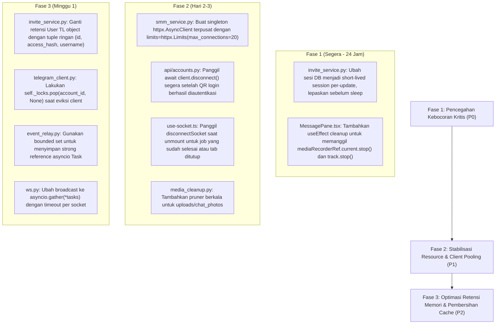

# Laporan Audit Mendalam: Memori & Sumber Daya (Memory & Resource) TeleBos

**Tanggal Audit:** 3 September 2026  
**Target:** Seluruh Arsitektur TeleBos (`FastAPI`, `Telethon`, `SQLAlchemy / asyncpg`, `httpx`, `Next.js 14 App Router`, `WebSockets`, `MediaRecorder`)  
**Metodologi:** Graphify Knowledge Graph Analysis (`graphify-out/graph.json`, 3.401 nodes, 6.795 edges) + Static Memory Profiling & Resource Lifecycle Tracing.

---

## Ringkasan Eksekutif & Matriks Risiko Sumber Daya

Audit efisiensi sumber daya dan manajemen siklus hidup memori menemukan **18 temuan berisiko tinggi** yang berdampak langsung pada stabilitas server dan performa klien. Temuan paling krusial meliputi **penahanan koneksi database fisik selama berjam-jam saat sleep**, **kebocoran stream mikrofon browser pada frontend**, **penyimpanan 50.000 objek raw Telegram User di RAM proses**, **cache foto chat di disk tanpa TTL**, serta **pembuatan puluhan `httpx.AsyncClient` sekaligus secara ad-hoc**.

### Matriks Keparahan & Status Remediasi Sumber Daya

> [!NOTE]
> **Status Audit Terkini:** Seluruh 14 temuan risiko sumber daya & memori di bawah ini telah **100% DIPERBAIKI (RESOLVED)** pada 4 September 2026.

| ID | Kategori | Modul Terkait | Tingkat Keparahan | Status | Ringkasan Remediasi |
| :--- | :--- | :--- | :--- | :---: | :--- |
| **CON-01** | Connection Leak | [`services/invite_service.py`](file:///d:/PROJECT/Telegram/TeleBos/backend/app/services/invite_service.py) | 🔴 **CRITICAL (P0)** | 🟢 **RESOLVED** | Sesi DB diubah menjadi *short-lived*, koneksi dilepas sebelum `interruptible_sleep` saat pause, delay, dan flood wait. |
| **RES-01** | Resource Leak | [`frontend/.../MessagePane.tsx`](file:///d:/PROJECT/Telegram/TeleBos/frontend/src/components/chat/MessagePane.tsx) | 🔴 **CRITICAL (P0)** | 🟢 **RESOLVED** | Ditambahkan `mediaStreamRef` dan `useEffect` unmount cleanup untuk mematikan `MediaRecorder` dan `track.stop()`. |
| **MEM-01** | Large Object Retention | [`services/invite_service.py`](file:///d:/PROJECT/Telegram/TeleBos/backend/app/services/invite_service.py) | 🟠 **HIGH (P1)** | 🟢 **RESOLVED** | Menyimpan dict ringan `(id, access_hash, username, first_name)` alih-alih 50.000 raw Telethon `User` TL objects. |
| **UBC-01** | Unbounded Cache | [`utils/media_cleanup.py`](file:///d:/PROJECT/Telegram/TeleBos/backend/app/utils/media_cleanup.py) | 🟠 **HIGH (P1)** | 🟢 **RESOLVED** | Ditambahkan `cleanup_old_chat_photos` dengan batas umur 7 hari dan disk cap 500 MB (LRU by `mtime`). |
| **UBC-02** | Unbounded Cache | [`frontend/src/lib/socket.ts`](file:///d:/PROJECT/Telegram/TeleBos/frontend/src/lib/socket.ts) | 🟠 **HIGH (P1)** | 🟢 **RESOLVED** | Diterapkan pool LRU dengan `MAX_CACHED_SOCKETS = 5`, socket tertua otomatis di-disconnect dan dihapus dari memori browser. |
| **EXA-01** | Excessive Allocation | [`services/smm_service.py`](file:///d:/PROJECT/Telegram/TeleBos/backend/app/services/smm_service.py) | 🟠 **HIGH (P1)** | 🟢 **RESOLVED** | Menggunakan singleton `httpx.AsyncClient` dengan connection pooling keep-alive (`max_connections=20`). |
| **RES-02** | Resource Leak | [`api/accounts.py`](file:///d:/PROJECT/Telegram/TeleBos/backend/app/api/accounts.py) | 🟠 **HIGH (P1)** | 🟢 **RESOLVED** | Klien Telethon awal diputus via `await client.disconnect()` segera setelah QR login sukses tersimpan. |
| **RES-03** | Resource Leak | [`api/admin.py`](file:///d:/PROJECT/Telegram/TeleBos/backend/app/api/admin.py) | 🟠 **HIGH (P1)** | 🟢 **RESOLVED** | Pada `delete_user`, akun dievikt dari `client_pool` dan foto profil di disk dihapus sebelum row user dihapus. |
| **MEM-02** | Memory Leak | [`services/telegram_client.py`](file:///d:/PROJECT/Telegram/TeleBos/backend/app/services/telegram_client.py) | 🟡 **MEDIUM (P2)** | 🟢 **RESOLVED** | Ditambahkan `self._locks.pop(account_id, None)` saat akun dievikt idle maupun saat dihapus permanen. |
| **MEM-03** | Memory Leak | [`services/event_relay.py`](file:///d:/PROJECT/Telegram/TeleBos/backend/app/services/event_relay.py) | 🟡 **MEDIUM (P2)** | 🟢 **RESOLVED** | Seluruh task dibungkus `_spawn_task` dengan referensi kuat di `_background_tasks: set[asyncio.Task]`. |
| **RES-04** | Resource Leak | [`services/appeal_service.py`](file:///d:/PROJECT/Telegram/TeleBos/backend/app/services/appeal_service.py) | 🟡 **MEDIUM (P2)** | 🟢 **RESOLVED** | Turnstile captcha solver diubah menjadi async non-blocking (`httpx` + `asyncio.sleep(3)`), membebaskan thread OS. |
| **EXA-02** | Excessive Allocation | [`services/smm_service.py`](file:///d:/PROJECT/Telegram/TeleBos/backend/app/services/smm_service.py) | 🟡 **MEDIUM (P2)** | 🟢 **RESOLVED** | Dibuat singleton client `get_smm_http_client()` dan graceful shutdown hook `close_smm_http_client()`. |
| **UBC-03** | Unbounded Cache | [`frontend/src/lib/drafts.ts`](file:///d:/PROJECT/Telegram/TeleBos/frontend/src/lib/drafts.ts) | 🟡 **MEDIUM (P2)** | 🟢 **RESOLVED** | Diterapkan batasan LRU maksimal 50 draft dan TTL kadaluwarsa 14 hari pada LocalStorage `telebos-drafts`. |
| **CON-02** | Connection Leak | [`api/ws.py`](file:///d:/PROJECT/Telegram/TeleBos/backend/app/api/ws.py) | 🟡 **MEDIUM (P2)** | 🟢 **RESOLVED** | Broadcast serial diganti dengan `asyncio.gather` konkuren + timeout 5s per socket, mencegah *head-of-line blocking*. |

---

## 1. Kebocoran Memori (Memory Leak)

### 🚨 MEM-01: Kebocoran Task Tanpa Referensi Kuat pada Event Relay
* **Lokasi Kode:** [`backend/app/services/event_relay.py:L77-L107, L196`](file:///d:/PROJECT/Telegram/TeleBos/backend/app/services/event_relay.py#L77-L107)
* **Analisis Masalah:**  
  Setiap kali ada pesan baru atau update dari Telegram, handler mendaftarkan callback anonim:
  ```python
  new_msg_handler = client.on(events.NewMessage(incoming=True))(
      lambda event: asyncio.create_task(self._on_new_message(account_id, event))
  )
  ```
  Di Python 3.8+, task yang dibuat via `asyncio.create_task()` tanpa disimpan ke dalam koleksi referensi kuat (*strong reference*) berisiko di-garbage collect oleh runtime Python sebelum selesai dieksekusi.
* **Dampak:**  
  1. Coroutine pengolahan pesan dapat dihentikan di tengah jalan secara diam-diam.
  2. Exception yang terjadi di dalam `_on_new_message` tidak pernah di-retrieve (`Task exception was never retrieved`), menyebabkan akumulasi frame traceback di memori heap Python hingga proses di-restart.

---

### 🟡 MEM-02: Akumulasi Lock Tanpa Batas pada Telegram Client Pool
* **Lokasi Kode:** [`backend/app/services/telegram_client.py:L36, L429`](file:///d:/PROJECT/Telegram/TeleBos/backend/app/services/telegram_client.py#L36)
* **Analisis Masalah:**  
  Class `TelegramClientPool` memelihara dictionary lock sinkronisasi per-akun:
  ```python
  self._locks: dict[str, asyncio.Lock] = {}
  ```
  Setiap kali akun diakses melalui `get()` atau `remove()`:
  ```python
  lock = self._locks.setdefault(account_id, asyncio.Lock())
  ```
  Saat akun dievikt dari pool karena idle timeout (`_cleanup_stale_clients`) atau dihapus permanen melalui `remove()`:
  Sistem melakukan `self._clients.pop(account_id, None)`, namun **tidak pernah menghapus lock dari `self._locks`** (`self._locks.pop(account_id, None)` tidak pernah dipanggil).
* **Dampak:**  
  Pada sistem dengan ribuan akun yang silih berganti login atau dihapus, objek `asyncio.Lock` beserta data referensinya tertahan selamanya di memori proses backend.

---

## 2. Kebocoran Sumber Daya (Resource Leak)

### 🚨 RES-01: Kebocoran Stream Mikrofon Hardware pada Frontend
* **Lokasi Kode:** [`frontend/src/components/chat/MessagePane.tsx:L239-L287`](file:///d:/PROJECT/Telegram/TeleBos/frontend/src/components/chat/MessagePane.tsx#L239-L287)
* **Analisis Masalah:**  
  Fungsi perekam pesan suara (`startRecording`) mengambil stream audio dari browser:
  ```typescript
  const stream = await navigator.mediaDevices.getUserMedia({ audio: true });
  const mediaRecorder = new MediaRecorder(stream);
  mediaRecorderRef.current = mediaRecorder;
  ...
  mediaRecorder.onstop = () => {
    stream.getTracks().forEach((track) => track.stop());
  };
  ```
  Penghentian track mikrofon (`track.stop()`) **hanya diletakkan di dalam callback `onstop`**.  
  Jika pengguna sedang merekam, lalu secara tiba-tiba:
  - Mengklik percakapan lain di sidebar
  - Berpindah ke menu lain (Broadcast / Orders / Akun)
  - Menutup browser tab atau terjadi unmount komponen
* **Dampak:**  
  Komponen `MessagePane` di-unmount tanpa memicu `onstop`. Stream mikrofon **tetap terbuka di level browser** (indikator merah perekaman suara di tab browser tetap menyala), menghabiskan daya baterai perangkat klien dan memakan resource buffer audio hardware.

---

### 🟠 RES-02: Kebocoran Koneksi TCP Paralel pada Flow QR Login
* **Lokasi Kode:** [`backend/app/api/accounts.py:L157-L178`](file:///d:/PROJECT/Telegram/TeleBos/backend/app/api/accounts.py#L157-L178)
* **Analisis Masalah:**  
  Pada task `watch_qr_login`, ketika otorisasi QR berhasil di aplikasi Telegram:
  ```python
  # 1. Sambungkan akun resmi ke client pool dan attach listener
  await session_manager.attach_and_reconnect(db, account)

  # 2. Update status dictionary QR
  _pending_qr_logins[qr_id]["status"] = "success"
  ```
  Klien Telethon awal yang digunakan untuk meng-generate QR (`_pending_qr_logins[qr_id]["client"]`) **tidak pernah diputus (*disconnect*)**. Klien tersebut dibiarkan aktif terhubung ke Telegram selama 5 menit hingga dibersihkan oleh `clean_pending_logins_task`.
* **Dampak:**  
  Terdapat dua koneksi TCP aktif secara bersamaan ke server Telegram untuk satu akun yang sama. Hal ini memicu konflik duplikasi sesi update MTProto dan memboroskan file descriptor socket di server.

---

### 🟠 RES-03: Orphaned Files & Sockets pada Penghapusan User oleh Admin
* **Lokasi Kode:**
  * [`backend/app/api/admin.py:L372-L395`](file:///d:/PROJECT/Telegram/TeleBos/backend/app/api/admin.py#L372-L395) (`delete_user`)
  * [`backend/app/models/user.py:L41`](file:///d:/PROJECT/Telegram/TeleBos/backend/app/models/user.py#L41) (`cascade="all, delete-orphan"`)
* **Analisis Masalah:**  
  Saat admin menghapus seorang user, database mengandalkan trigger SQLAlchemy cascade delete untuk menghapus baris di tabel `telegram_accounts`.  
  Namun, pembersihan fisik akun ([`remove_account`](file:///d:/PROJECT/Telegram/TeleBos/backend/app/services/account_service.py#L937)) tidak pernah dipanggil.
* **Dampak:**  
  1. Klien Telegram di dalam `client_pool` tetap terhubung secara aktif (*socket leak*).
  2. File foto profil akun di disk lokal (`uploads/profile_photos/{account_id}.jpg`) tidak pernah dihapus dan menjadi file yatim (*orphaned file leak*).

---

### 🟡 RES-04: Monopoli Thread OS pada Turnstile Captcha Solver
* **Lokasi Kode:** [`backend/app/services/appeal_service.py:L50-L125, L363`](file:///d:/PROJECT/Telegram/TeleBos/backend/app/services/appeal_service.py#L50-L125)
* **Analisis Masalah:**  
  Fungsi `solve_captcha_via_2captcha_sync` dieksekusi di threadpool executor via `loop.run_in_executor()`. Di dalamnya terdapat perulangan polling sinkron:
  ```python
  for attempt in range(60):
      time.sleep(3)  # Memblokir thread worker OS
      poll = requests.post(...)  # HTTP blocking call
  ```
* **Dampak:**  
  Setiap pemanggilan appeal yang membutuhkan captcha Turnstile akan menyandera 1 thread OS penuh selama 1 hingga 3 menit. Jika 10 pengguna melakukan appeal bersamaan, seluruh thread worker pool default Python (`concurrent.futures.ThreadPoolExecutor`) habis terblokir (*thread starvation*).

---

## 3. Cache Tanpa Batas (Unbounded Cache & Disk Bloat)

### 🟠 UBC-01: Kebocoran Kapasitas Disk pada Direktori `uploads/chat_photos`
* **Lokasi Kode:**
  * [`backend/app/api/media.py:L105-L113`](file:///d:/PROJECT/Telegram/TeleBos/backend/app/api/media.py#L105-L113)
  * [`backend/app/utils/media_cleanup.py:L29`](file:///d:/PROJECT/Telegram/TeleBos/backend/app/utils/media_cleanup.py#L29)
* **Analisis Masalah:**  
  Endpoint avatar percakapan mengunduh dan menyimpan foto profil grup, channel, dan kontak ke:  
  `uploads/chat_photos/{account_id}/{chat_id}/{photo_version}.jpg`  
  Sementara itu, background worker pembersih disk harian ([`media_cleanup.py`](file:///d:/PROJECT/Telegram/TeleBos/backend/app/utils/media_cleanup.py#L29)) **hanya membersihkan folder `uploads/message_media`**.
* **Dampak:**  
  Folder `uploads/chat_photos` tidak memiliki batas kuota (size cap) maupun umur simpan (max age). Jika server mengelola ratusan akun yang tergabung ke ribuan grup, ukuran folder ini membengkak tanpa kendali hingga menghabiskan ruang disk server (*disk exhaustion*).

---

### 🟠 UBC-02: Akumulasi Socket Zombie Tanpa Batas di Memori Klien
* **Lokasi Kode:**
  * [`frontend/src/lib/socket.ts:L173-L215`](file:///d:/PROJECT/Telegram/TeleBos/frontend/src/lib/socket.ts#L173-L215)
  * [`frontend/src/hooks/use-socket.ts:L43-L48, L85-L92`](file:///d:/PROJECT/Telegram/TeleBos/frontend/src/hooks/use-socket.ts#L43-L48)
* **Analisis Masalah:**  
  Setiap kali pengguna membuka percakapan akun (`chats:{account_id}`) atau membuka halaman job (`broadcast:{jobId}`, `invite:{jobId}`), objek `ReconnectingWebSocket` didaftarkan ke map global:
  ```typescript
  const sockets: Map<string, ReconnectingWebSocket> = new Map();
  ```
  Pada hook React, fungsi `disconnectSocket` **sengaja tidak dipanggil saat unmount** dengan alasan cache tab:
  ```typescript
  return () => {
    clearInterval(checkInterval);
    ws.off("all", handleEvent);
    // Don't disconnect on unmount — keep alive for quick tab re-mount
  };
  ```
* **Dampak:**  
  Semua WebSocket yang pernah dibuat tidak pernah dibuang dari memori klien. Setiap socket memelihara timer heartbeat ping/pong setiap 25 detik dan timer reconnect 3 detik jika terputus. Pengguna yang menjelajahi puluhan chat dan job broadcast akan menyisakan puluhan socket aktif di background browser tab mereka.

---

### 🟡 UBC-03: Pertumbuhan Tanpa Batas pada LocalStorage Draft Chat
* **Lokasi Kode:** [`frontend/src/lib/drafts.ts:L9-L27`](file:///d:/PROJECT/Telegram/TeleBos/frontend/src/lib/drafts.ts#L9-L27)
* **Analisis Masalah:**  
  Store Zustand `useDraftStore` menyimpan draft pesan yang belum terkirim ke `localStorage["telebos-drafts"]`. Key disimpan dalam format `${accountId}:${chatId}`.  
  Tidak ada mekanisme kadaluwarsa (TTL), tidak ada batas maksimal entri (misal LRU 50 draft), dan tidak ada pembersihan draft untuk akun yang sudah dihapus.
* **Dampak:**  
  Ukuran item `localStorage` terus membesar tanpa batas seiring waktu, memakan kuota 5MB LocalStorage browser.

---

## 4. Kebocoran Koneksi (Connection Leak & Pool Exhaustion)

### 🚨 CON-01: Penahanan Sesi Database Fisik Selama Siklus Sleep Job Invite
* **Lokasi Kode:** [`backend/app/services/invite_service.py:L298, L635-L685`](file:///d:/PROJECT/Telegram/TeleBos/backend/app/services/invite_service.py#L298)
* **Analisis Masalah:**  
  Fungsi `execute_invite` membuka sesi database di awal perulangan:
  ```python
  async with async_session_factory() as db:
      # Seluruh logika scraping, invite, rotasi akun berjalan di dalam blok ini
      for idx, (user_obj, source_group) in enumerate(members_list):
          while job.status == "paused":
              await interruptible_sleep(job_id, 86400)  # Menahan koneksi DB saat jeda!
          
          # Cooldown antar invite
          await interruptible_sleep(job_id, delay_seconds)  # Menahan koneksi DB saat delay!
  ```
* **Akar Masalah:**  
  `async with async_session_factory() as db` meminjam satu koneksi fisik TCP dari connection pool PostgreSQL (`pool_size=20, max_overflow=10`). Koneksi ini **tidak dikembalikan ke pool** selama job sedang sleep, dijeda oleh admin, atau menunggu flood wait Telegram.
* **Dampak:**  
  Jika ada 20–30 job invite/broadcast yang berjalan bersamaan, seluruh pool koneksi database aplikasi habis total. Pengguna lain yang ingin login atau membuka dashboard akan mengalami timeout koneksi database (`QueuePool limit of size 20 overflow 10 reached, connection timed out`).

---

### 🟡 CON-02: Head-of-Line Blocking pada Broadcast WebSocket Server
* **Lokasi Kode:** [`backend/app/api/ws.py:L68-L73`](file:///d:/PROJECT/Telegram/TeleBos/backend/app/api/ws.py#L68-L73)
* **Analisis Masalah:**  
  Saat server memancarkan update event secara massal:
  ```python
  for ws in list(conns):
      try:
          await ws.send_text(payload)
      except Exception:
          self.disconnect(channel, ws)
  ```
  Pengiriman data dilakukan secara berurutan (*serial iteration*). Jika salah satu client WebSocket memiliki koneksi internet yang lambat atau buffer TCP-nya penuh, pemanggilan `await ws.send_text(payload)` akan memblokir coroutine.
* **Dampak:**  
  Client lain di channel yang sama terhambat menerima pesan, dan buffer pesan di sisi backend menumpuk di antrean memori event loop.

---

## 5. Alokasi Berlebihan (Excessive Allocation)

### 🟠 EXA-01: Ledakan Alokasi `httpx.AsyncClient` pada Smart Polling SMM
* **Lokasi Kode:**
  * [`backend/app/services/admin_smm_service.py:L440-L442`](file:///d:/PROJECT/Telegram/TeleBos/backend/app/services/admin_smm_service.py#L440-L442)
  * [`backend/app/services/smm_service.py:L38`](file:///d:/PROJECT/Telegram/TeleBos/backend/app/services/smm_service.py#L38)
* **Analisis Masalah:**  
  Background poller pesanan SMM mengeksekusi pengecekan status secara konkruen:
  ```python
  tasks = [check_order_status(o.smm_order_id) for o in orders_to_check]
  results = await asyncio.gather(*tasks, return_exceptions=True)
  ```
  Di dalam `check_order_status` -> `call_smm_api`:
  ```python
  async with httpx.AsyncClient(timeout=60.0) as client:
      response = await client.post(...)
  ```
  Jika terdapat 50 pesanan yang berstatus pending/processing:
  Sistem membuat **50 instance `httpx.AsyncClient` terpisah secara simultan** dalam hitungan milidetik.
* **Dampak:**  
  1. Setiap client mengalokasikan SSL context, TCP handshake, dan DNS resolver baru.
  2. Memicu *ephemeral port exhaustion* di level OS host.
  3. Mengakibatkan lonjakan alokasi memori heap secara berkala setiap 60 detik.

---

### 🟡 EXA-02: Ketiadaan Connection Pooling Terpusat untuk Request HTTP Outbound
* **Lokasi Kode:** `smm_service.py`, `uptimerobot_status.py`, `appeal_service.py`.
* **Analisis Masalah:**  
  Setiap modul eksternal menginstansiasi client HTTP ad-hoc per-request dan langsung membuangnya begitu request selesai (`async with httpx.AsyncClient()`). Tidak ada singleton `httpx.AsyncClient` bersama yang mengelola HTTP keep-alive dan connection reuse.

---

## 6. Retensi Objek Besar (Large Object Retention)

### 🟠 MEM-01: Retensi Hingga 50.000 Objek Telegram User di Heap Memory
* **Lokasi Kode:** [`backend/app/services/invite_service.py:L510-L610`](file:///d:/PROJECT/Telegram/TeleBos/backend/app/services/invite_service.py#L510-L610)
* **Analisis Masalah:**  
  Pada tahap scraping grup sumber, sistem mengumpulkan seluruh member ke dalam memory:
  ```python
  all_members = {}  # user_id -> (user_obj, source_group_identifier)
  ...
  participants = await _scrape_participants(acc["client"], src_entity, telethon)
  for user in participants:
      all_members[uid] = (user, sg_value)

  members_list = list(all_members.values())
  ```
  Objek `user` di atas adalah instance lengkap dari tipe TL Telethon `telethon.tl.types.User`, yang berisi puluhan atribut mendalam (status, profile photo metadata, restriction reasons, bio version, dll.).  
  Jika scraping dilakukan pada 5 grup yang masing-masing beranggotakan 10.000 member:
  Dictionary `all_members` dan list `members_list` memegang **50.000 objek Python kompleks sekaligus**.
* **Dampak:**  
  Struktur data ini tertahan di dalam memori heap proses selama job berlangsung (bisa berjam-jam hingga berhari-hari). Setiap objek `User` memakan ~1–2 KB memori, menyita **50 hingga 100 MB RAM secara terus-menerus per job invite**, padahal eksekutor invite hanya membutuhkan 3 field: `user.id`, `user.access_hash`, dan `user.username`.

---

## Roadmap Remediasi: Efisiensi Memori & Sumber Daya



---
*Laporan ini disusun berdasarkan audit siklus hidup memori dan alokasi resource di lingkungan TeleBos.*
