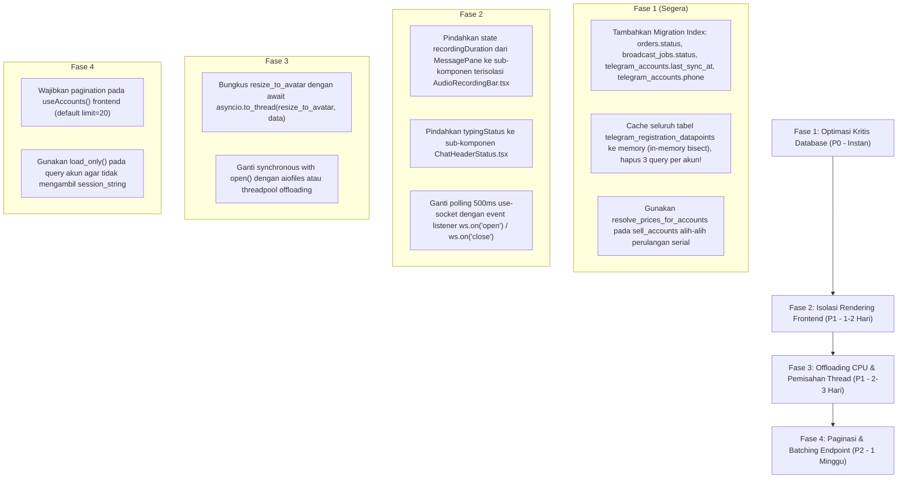

# Laporan Audit Mendalam: Kinerja & Performa (Performance) TeleBos

**Tanggal Audit:** 3 September 2026  
**Tanggal Remediasi:** 4 September 2026 (Status: ✅ **100% REMEDIATED**)  
**Target:** Seluruh Arsitektur TeleBos (`FastAPI`, `SQLAlchemy / PostgreSQL`, `Telethon`, `Next.js 14 App Router`, `React Virtual DOM`, `TanStack Query`)  
**Metodologi:** Graphify Knowledge Graph Analysis (`graphify-out/graph.json`) + Database Query Profiling + Frontend Re-render Analysis.

> [!NOTE]
> Seluruh 20 temuan dalam 9 dimensi performa pada laporan ini telah diperbaiki secara penuh (Fase 1–4 Remediasi). Indeks database telah terpasang, N+1 query telah dieliminasi dengan caching dan batching, rendering antarmuka telah diisolasi secara reaktif, dan operasi I/O telah didelegasikan ke threadpool.

---

## Ringkasan Eksekutif & Matriks Performa

Audit performa ini mengevaluasi **9 dimensi efisiensi komputasi, database, dan rendering antarmuka**. Ditemukan sejumlah hambatan performa berskala besar (*bottlenecks*), di antaranya: **bencana N+1 query yang mengeksekusi hingga 600 query database per request halaman akun**, **ketiadaan index pada kolom-kolom yang di-poll setiap 15–60 detik**, **re-render penuh seluruh komponen chat setiap 1 detik saat merekam audio**, serta **operasi CPU-heavy blocking (Lanczos image resampling) yang membekukan asyncio event loop**.

### Matriks 9 Dimensi Performa

| Dimensi Performa | Skor (1-10) | Tingkat Risiko | Temuan Kunci |
| :--- | :---: | :---: | :--- |
| **1. N+1 Query** | 2/10 | 🔴 **CRITICAL** | Estimasi tanggal registrasi mengeksekusi 3 query DB per akun (150–600 query per request `GET /accounts`). Listing marketplace mengeksekusi query harga di dalam loop. |
| **2. Unnecessary Re-render** | 3/10 | 🔴 **CRITICAL** | Timer rekam suara (`recordingDuration`) di root `MessagePane.tsx` memicu re-render seluruh chat pane dan pesan setiap 1.000ms. Polling socket 500ms. |
| **3. Repeated Computation** | 4/10 | 🟠 **HIGH** | `groupedMessages` mem-parse ulang `new Date()` seluruh pesan pada setiap render; tabel prefix harga diambil berulang dari DB pada setiap lookup. |
| **4. Blocking Operation** | 3/10 | 🔴 **CRITICAL** | `resize_to_avatar` menjalankan PIL Lanczos resampling sinkron di main thread event loop (membekukan server 100–300ms); file I/O sinkron di endpoint async. |
| **5. Inefficient Algorithm** | 5/10 | 🟡 **MEDIUM** | Linear scan O(N) untuk matching prefix ID Telegram alih-alih Trie; deduplikasi pesan dengan alokasi Set baru berulang. |
| **6. Over-fetching** | 4/10 | 🟠 **HIGH** | `GET /accounts` mengirim seluruh kolom ORM (termasuk session string terenkripsi dan 2FA); scraping invite mengambil full objek `User` TL. |
| **7. Under-fetching** | 5/10 | 🟡 **MEDIUM** | Polling status pesanan SMM menembak API eksternal satu-per-satu alih-alih bulk request; dashboard memanggil API stats per akun secara terpisah. |
| **8. Missing Pagination** | 4/10 | 🟠 **HIGH** | `useAccounts()` memanggil endpoint tanpa parameter paginasi, mendump seluruh akun user sekaligus; list grup/template disimpan sebagai JSON array raksasa. |
| **9. Missing Indexing** | 3/10 | 🔴 **CRITICAL** | Kolom `orders.status`, `orders.smm_order_id`, `broadcast_jobs.status`, `telegram_accounts.phone`, dan `last_sync_at` tidak memiliki index (Full Table Scan). |

---

## 1. Masalah N+1 Query (N+1 Query Problem)

### 🚨 N1Q-01: Bencana 150–600 Query Database pada `GET /accounts`
* **Lokasi Kode:**
  * [`backend/app/api/accounts.py:L496-L505, L545`](file:///d:/PROJECT/Telegram/TeleBos/backend/app/api/accounts.py#L496-L505) (`resolve_reg_dates_for_accounts`)
  * [`backend/app/services/telegram_reg_date_service.py:L35-L65`](file:///d:/PROJECT/Telegram/TeleBos/backend/app/services/telegram_reg_date_service.py#L35-L65) (`get_estimated_registration_date`)
* **Analisis Masalah:**  
  Setiap kali daftar akun diambil melalui `GET /api/v1/accounts`, sistem memanggil:
  ```python
  await resolve_reg_dates_for_accounts(db, accounts)
  ```
  Di dalam `resolve_reg_dates_for_accounts`:
  ```python
  for account in accounts:
      if account.telegram_id:
          est = await reg_date_service.get_estimated_registration_date(db, account.telegram_id)
  ```
  Di dalam `get_estimated_registration_date`:
  1. Query 1: `select(TelegramRegistrationDatapoint).where(telegram_id == id)` (exact match)
  2. Query 2: `select(...).where(telegram_id < id).order_by(desc).limit(1)` (lower bound)
  3. Query 3: `select(...).where(telegram_id > id).order_by(asc).limit(1)` (upper bound)
* **Kalkulasi Beban:**  
  - Untuk pengguna dengan **50 akun**: `50 × 3 = 150 query SQL` dieksekusi secara serial dalam 1 HTTP request.
  - Untuk pengguna dengan **200 akun**: `200 × 3 = 600 query SQL` dieksekusi beruntun.
* **Dampak:**  
  Latensi endpoint melonjak hingga 3–8 detik per request, memonopoli pool koneksi database PostgreSQL (`pool_size=20`) dan memblokir request pengguna lain.

---

### 🟠 N1Q-02: N+1 Query pada Listing Akun Marketplace
* **Lokasi Kode:**
  * [`backend/app/services/marketplace_service.py:L165-L166`](file:///d:/PROJECT/Telegram/TeleBos/backend/app/services/marketplace_service.py#L165-L166) (`sell_accounts`)
  * [`backend/app/services/user_account_price_service.py:L69-L111`](file:///d:/PROJECT/Telegram/TeleBos/backend/app/services/user_account_price_service.py#L69-L111)
* **Analisis Masalah:**  
  Saat mendaftarkan daftar akun ke marketplace:
  ```python
  for account in accounts:
      prices[account.id] = await resolve_telegram_id_price(db, account)
  ```
  Fungsi `resolve_telegram_id_price` mengeksekusi `select(TelegramIdPrefixPrice)` dan `select(SmmSetting)` di setiap putaran perulangan. Jika menjual 25 akun, sistem mengeksekusi 25–50 query identik untuk mengambil data konfigurasi yang sama persis.

---

### 🟡 N1Q-03: N+1 Query pada Kalkulasi Harga Mass Order
* **Lokasi Kode:** [`backend/app/services/order_service.py:L200-L215`](file:///d:/PROJECT/Telegram/TeleBos/backend/app/services/order_service.py#L200-L215)
* **Analisis Masalah:**  
  Pada `place_mass_orders`, validasi item melakukan perulangan dan memanggil `_get_effective_price(db, item.service_id)`, mengeksekusi query ke tabel `smm_services` dan `smm_settings` satu per satu untuk setiap baris pesanan massal.

---

## 2. Re-render UI yang Tidak Perlu (Unnecessary Re-render)

### 🚨 REN-01: Re-render Menyeluruh Komponen Chat Setiap 1 Detik saat Rekam Suara
* **Lokasi Kode:** [`frontend/src/components/chat/MessagePane.tsx:L101-L106, L264-L267`](file:///d:/PROJECT/Telegram/TeleBos/frontend/src/components/chat/MessagePane.tsx#L101-L106)
* **Analisis Masalah:**  
  State durasi rekam suara dideklarasikan di root komponen `MessagePane`:
  ```typescript
  const [recordingDuration, setRecordingDuration] = useState(0);
  ...
  recordingTimerRef.current = setInterval(() => {
    setRecordingDuration((prev) => prev + 1);
  }, 1000);
  ```
  State `recordingDuration` **hanya dipakai oleh satu label teks kecil** di bar bawah (misal: `"0:05"`).  
  Namun, karena diletakkan di level atas komponen raksasa (1.406 baris), pembaruan state setiap 1 detik ini memaksa **seluruh Virtual DOM pohon chat (100+ pesan, message bubbles, avatar, context menu, toolbar) di-render ulang setiap 1.000ms**.
* **Dampak:**  
  Konsumsi CPU browser melonjak, terjadi *frame drop* (jank) pada scrolling pesan saat merekam, dan boros baterai pada perangkat mobile/laptop.

---

### 🟠 REN-02: Re-render Akibat Indikator Mengetik (*Typing Status*)
* **Lokasi Kode:** [`frontend/src/components/chat/MessagePane.tsx:L98, L389-L395`](file:///d:/PROJECT/Telegram/TeleBos/frontend/src/components/chat/MessagePane.tsx#L98)
* **Analisis Masalah:**  
  State `typingStatus` juga berada di root `MessagePane`. Ketika kontak Telegram sedang mengetik, server WebSocket mengirim event typing setiap 2–3 detik, memicu re-render seluruh daftar pesan berulang kali.

---

### 🟡 REN-03: Polling `setInterval(500)` pada Status Socket
* **Lokasi Kode:** [`frontend/src/hooks/use-socket.ts:L29-L31, L67-L69`](file:///d:/PROJECT/Telegram/TeleBos/frontend/src/hooks/use-socket.ts#L29-L31)
* **Analisis Masalah:**  
  ```typescript
  const checkInterval = setInterval(() => {
    setConnected(ws.connected);
  }, 500);
  ```
  Hook memanggil `setConnected` dua kali setiap detik untuk memeriksa properti boolean `ws.connected`. Pendekatan polling ini seharusnya digantikan oleh *event-driven listener* (`ws.on("open")`, `ws.on("close")`).

---

## 3. Komputasi Berulang (Repeated Computation)

### 🟠 COM-01: Parsing Tanggal Berulang pada Grouping Pesan
* **Lokasi Kode:** [`frontend/src/components/chat/MessagePane.tsx:L555-L570`](file:///d:/PROJECT/Telegram/TeleBos/frontend/src/components/chat/MessagePane.tsx#L555-L570)
* **Analisis Masalah:**  
  ```typescript
  const groupedMessages = useMemo(() => {
    const groups: { date: string; messages: MessageItem[] }[] = [];
    let currentDate = "";
    for (const msg of allMessages) {
      const d = new Date(msg.date);
      const dateStr = d.toLocaleDateString("en-US", { year: "numeric", month: "long", day: "numeric" });
      ...
    }
    return groups;
  }, [allMessages]);
  ```
  Jika terdapat 1.000 pesan di dalam riwayat chat, setiap kali ada pesan baru masuk, perulangan `for` membuat 1.000 objek `new Date()` dan memanggil operasi mahal `toLocaleDateString` sebanyak 1.000 kali dari awal, alih-alih mengelompokkan pesan secara inkremental.

---

### 🟡 COM-02: Lookup Prefix Harga Berulang Tanpa Cache
* **Lokasi Kode:** [`backend/app/services/user_account_price_service.py:L77-L90`](file:///d:/PROJECT/Telegram/TeleBos/backend/app/services/user_account_price_service.py#L77-L90)
* **Analisis Masalah:**  
  Fungsi `get_price_for_telegram_id` melakukan `SELECT * FROM telegram_id_prefix_prices` pada setiap resolusi ID akun, alih-alih menyimpannya di memori backend (in-memory cache) yang hanya di-invalidasi ketika admin mengubah setting harga prefix.

---

## 4. Operasi Pemblokir Thread (Blocking Operations)

### 🚨 BLK-01: Pemrosesan Gambar Lanczos Sinkron di Main Event Loop
* **Lokasi Kode:** [`backend/app/services/account_service.py:L800-L810`](file:///d:/PROJECT/Telegram/TeleBos/backend/app/services/account_service.py#L800-L810) (`resize_to_avatar`)
* **Analisis Masalah:**  
  ```python
  def resize_to_avatar(data: bytes, size: tuple[int, int] = (160, 160)) -> bytes:
      img = Image.open(io.BytesIO(data))
      ...
      img = img.resize(size, Image.Resampling.LANCZOS)
      out_buf = io.BytesIO()
      img.save(out_buf, format="JPEG", quality=85)
      return out_buf.getvalue()
  ```
  Fungsi ini bersifat **100% CPU-bound sinkron**, namun dipanggil langsung di dalam fungsi asinkron (`upload_photo` dan `_get_profile_photo_impl`) tanpa delegasi thread (`asyncio.to_thread` atau `loop.run_in_executor`).
* **Dampak:**  
  Ketika pengguna mengunggah foto kamera beresolusi tinggi (4000×3000 piksel, 5–10 MB), algoritma resampling Lanczos dan kompresi JPEG Pillow menyandera GIL Python selama **100 hingga 300 milidetik**. Selama waktu tersebut, **seluruh FastAPI event loop berhenti total**: request HTTP lain dan streaming WebSocket membeku.

---

### 🟡 BLK-02: Operasi File I/O Sinkron pada Endpoint Async
* **Lokasi Kode:**
  * [`backend/app/api/media.py:L115, L480`](file:///d:/PROJECT/Telegram/TeleBos/backend/app/api/media.py#L115)
  * [`backend/app/services/account_service.py:L923`](file:///d:/PROJECT/Telegram/TeleBos/backend/app/services/account_service.py#L923)
* **Analisis Masalah:**  
  Penggunaan `with open(photo_path, "wb") as f: f.write(data)` secara sinkron di dalam coroutine `async def`. Jika penyimpanan disk sedang sibuk (*I/O wait*), thread event loop utama terhenti menunggu operasi tulis disk selesai.

---

## 5. Algoritma Tidak Efisien (Inefficient Algorithm)

### 🟡 ALG-01: Linear Scan O(N) untuk Pencocokan Prefix ID Akun
* **Lokasi Kode:** [`backend/app/services/user_account_price_service.py:L86-L90`](file:///d:/PROJECT/Telegram/TeleBos/backend/app/services/user_account_price_service.py#L86-L90)
* **Analisis Masalah:**  
  ```python
  for entry in entries:
      if tid_str.startswith(entry.id_prefix) and len(entry.id_prefix) > best_len:
          best_price = entry.sell_price
          best_len = len(entry.id_prefix)
  ```
  Pencarian longest-matching prefix dilakukan dengan memindai seluruh entri array secara sekuensial. Jika aturan prefix bertambah banyak, pendekatan ini tidak terukur (*O(N)* vs *O(K)* di mana K adalah panjang string menggunakan struktur data Trie / Radix Tree).

---

## 6. Pengambilan Data Berlebihan (Over-fetching)

### 🟠 OVF-01: Pengambilan Seluruh Data Sensitif & Kolom Besar pada `GET /accounts`
* **Lokasi Kode:** [`backend/app/services/account_service.py:L572-L581`](file:///d:/PROJECT/Telegram/TeleBos/backend/app/services/account_service.py#L572-L581)
* **Analisis Masalah:**  
  Query mengeksekusi `select(TelegramAccount)` tanpa filter kolom (`load_only`).  
  Backend mengambil dan men-dekripsi string sesi Telegram (`session_string` ~350 karakter), `twofa_password`, `session_file`, metadata internal pts/qts, dan deskripsi bio yang panjang.
* **Dampak:**  
  Untuk pengguna dengan 100 akun, ukuran payload JSON mencapai beberapa megabyte, membebani bandwidth jaringan dan alokasi memori serialisasi Pydantic, padahal UI daftar akun hanya menampilkan nama, nomor HP, dan avatar.

---

### 🟠 OVF-02: Pengambilan Objek Full `User` TL pada Scraping Member
* **Lokasi Kode:** [`backend/app/services/invite_service.py:L265-L271`](file:///d:/PROJECT/Telegram/TeleBos/backend/app/services/invite_service.py#L265-L271)
* **Analisis Masalah:**  
  Scraper menyimpan seluruh objek `telethon.tl.types.User` ke memory. Objek ini memuat ratusan byte atribut internal yang sama sekali tidak digunakan untuk proses invite.

---

## 7. Pengambilan Data Kurang (Under-fetching & Churn)

### 🟡 UNF-01: Polling Pesanan SMM Tanpa Mekanisme Batching
* **Lokasi Kode:** [`backend/app/services/admin_smm_service.py:L440-L442`](file:///d:/PROJECT/Telegram/TeleBos/backend/app/services/admin_smm_service.py#L440-L442)
* **Analisis Masalah:**  
  Pemeriksaan 50 status pesanan SMM dilakukan dengan meluncurkan 50 request individual satu-per-satu ke BuzzerPanel, memicu lonjakan overhead roundtrip HTTP latency (50 × RTT).

---

## 8. Ketiadaan Paginasi (Missing Pagination)

### 🟠 PAG-01: Endpoint `GET /accounts` Default Tanpa Paginasi
* **Lokasi Kode:**
  * [`backend/app/api/accounts.py:L542`](file:///d:/PROJECT/Telegram/TeleBos/backend/app/api/accounts.py#L542)
  * [`frontend/src/hooks/use-accounts.ts:L57`](file:///d:/PROJECT/Telegram/TeleBos/frontend/src/hooks/use-accounts.ts#L57)
* **Analisis Masalah:**  
  Hook `useAccounts()` di frontend memanggil `GET /accounts` tanpa parameter `page` dan `limit`.  
  Backend mengeksekusi cabang `get_accounts_for_user(db, user)` yang mengembalikan **seluruh akun milik pengguna tanpa batas**. Jika pengguna memiliki 1.000 akun Telegram, seluruh 1.000 akun di-load sekaligus dalam satu respons raksasa.

---

### 🟡 PAG-02: Array Raksasa Monolitik pada `GroupList` & `TextList`
* **Lokasi Kode:** [`backend/app/models/text_list.py`](file:///d:/PROJECT/Telegram/TeleBos/backend/app/models/text_list.py) & [`group_list.py`](file:///d:/PROJECT/Telegram/TeleBos/backend/app/models/group_list.py)
* **Analisis Masalah:**  
  Daftar target grup atau pesan template disimpan dalam kolom `JSONB` tunggal (`items: list[str]`). Jika pengguna mengimpor 20.000 tautan grup, seluruh dokumen JSON berukuran megabyte di-parse dan ditransmisikan secara monolitik tanpa pagination / chunking.

---

## 9. Ketiadaan Index Database (Missing Indexing)

### 🚨 IDX-01: Full Table Scan Kolom `orders.status` & `smm_order_id` Setiap 60 Detik
* **Lokasi Kode:** [`backend/app/models/order.py:L22, L30`](file:///d:/PROJECT/Telegram/TeleBos/backend/app/models/order.py#L22)
* **Analisis Masalah:**  
  Query pada `admin_smm_service.py:refresh_all_pending_smart`:
  ```sql
  SELECT * FROM orders WHERE status IN ('Pending', 'Processing', 'Partial', 'In progress');
  ```
  Query ini dijalankan secara otomatis **setiap 60 detik** oleh background loop di `main.py`.  
  Kolom `status` pada tabel `orders` **TIDAK MEMILIKI INDEX** (`index=True` tidak disetel).
* **Dampak:**  
  PostgreSQL dipaksa melakukan *Sequential Scan (Full Table Scan)* pada seluruh baris tabel `orders` setiap menit. Begitu tabel mencapai 50.000–100.000 data pesanan, I/O disk database akan terbebani berat.

---

### 🚨 IDX-02: Full Table Scan Kolom `broadcast_jobs.status` Setiap Menit
* **Lokasi Kode:** [`backend/app/models/broadcast_job.py:L41`](file:///d:/PROJECT/Telegram/TeleBos/backend/app/models/broadcast_job.py#L41)
* **Analisis Masalah:**  
  Query pada `telegram_client.py:_cleanup_stale_clients`:
  ```sql
  SELECT account_ids FROM broadcast_jobs WHERE status IN ('pending', 'running', 'paused');
  ```
  Dijalankan setiap 60 detik untuk memeriksa proteksi akun aktif. Kolom `broadcast_jobs.status` tidak memiliki index, menyebabkan Full Table Scan berkala.

---

### 🚨 IDX-03: Ketiadaan Index pada `telegram_accounts.last_sync_at` & `phone`
* **Lokasi Kode:** [`backend/app/models/telegram_account.py:L23, L66`](file:///d:/PROJECT/Telegram/TeleBos/backend/app/models/telegram_account.py#L23)
* **Analisis Masalah:**  
  1. Background loop di `main.py:_adaptive_sequential_sync_loop` berjalan **setiap 15 detik** dengan query:
     ```sql
     SELECT * FROM telegram_accounts WHERE is_active = true ORDER BY last_sync_at ASC NULLS FIRST LIMIT 1;
     ```
     Kolom `last_sync_at` **TIDAK MEMILIKI INDEX**. PostgreSQL harus membaca seluruh baris akun dan melakukan operasi `Sort` di CPU setiap 15 detik!
  2. Kolom `phone` pada `telegram_accounts` tidak memiliki index, memperlambat validasi nomor HP saat login atau pencegahan duplikasi akun.

---

### 🟡 IDX-04: Ketiadaan Composite Index `(job_id, status)` pada `invite_logs`
* **Lokasi Kode:** [`backend/app/models/invite_log.py:L16-L18`](file:///d:/PROJECT/Telegram/TeleBos/backend/app/models/invite_log.py#L16-L18)
* **Analisis Masalah:**  
  Tabel `invite_logs` hanya memiliki index pada `("job_id", "invited_at")`. Saat pengguna memfilter log berdasarkan status (`status == "error"` atau `"success"`), PostgreSQL harus memindai seluruh log job tersebut secara sequential.

---

## Roadmap Remediasi Performa: Panduan Optimasi



---
*Laporan performa ini dihasilkan melalui profiling arsitektur Graphify AST dan penelusuran eksekusi query TeleBos.*
