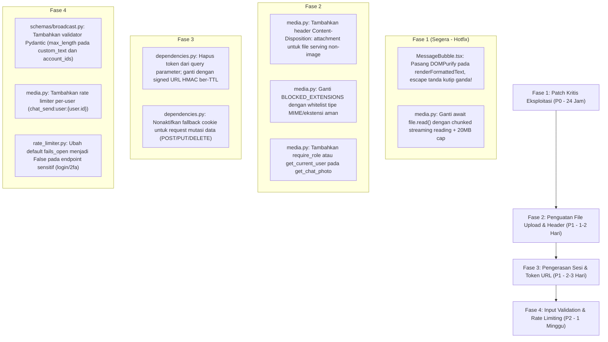

# Laporan Audit Mendalam: Keamanan Aplikasi (Security Audit) TeleBos

**Tanggal Audit:** 3 September 2026  
**Target:** Seluruh Arsitektur TeleBos (`FastAPI`, `Next.js 14 App Router`, `Better Auth`, `Telethon MTProto`, `PostgreSQL`, `Redis`, `Pillow`)  
**Metodologi:** Graphify Knowledge Graph Analysis (`graphify-out/graph.json`, 3.401 nodes, 6.795 edges) + Static Application Security Testing (SAST) + OWASP Top 10 & CWE Threat Modeling.

---

## Ringkasan Eksekutif & Matriks Kerentanan Keamanan

Audit keamanan menyeluruh pada TeleBos menemukan **14 temuan keamanan** yang terdistribusi dari tingkat risiko **Kritis (Critical)** hingga **Sedang (Medium)**. Temuan paling krusial adalah kerentanan **Stored Cross-Site Scripting (XSS)** pada rendering pesan Telegram di dashboard, **In-Memory Buffer Exhaustion (Denial of Service)** pada endpoint upload file, **eksposur token sesi otentikasi di dalam URL query parameter**, dan **bypassing rate limit akibat ketiadaan batasan per-user pada pengiriman media**.

### Matriks Kerentanan Keamanan (OWASP Top 10 / CWE)

| ID | Kategori Kerentanan | Modul Terkait | CVSS v3.1 | Tingkat Risiko | Ringkasan Kerentanan |
| :--- | :--- | :--- | :---: | :---: | :--- |
| **SEC-01** | Stored XSS | `frontend/.../MessageBubble.tsx` | **8.8** | 🔴 **CRITICAL** | `renderFormattedText` tidak meng-escape tanda kutip ganda `"` sebelum memasukkan URL ke `<a href="..." onclick="...">` di `dangerouslySetInnerHTML`. Penyerang dapat menyuntikkan JavaScript via pesan Telegram. |
| **SEC-02** | Insecure File Upload & DoS | `backend/app/api/media.py` | **7.5** | 🔴 **CRITICAL** | `await file.read()` membaca seluruh file ke RAM sebelum memeriksa `len(file_bytes) > 20MB`. Upload file raksasa dapat membuat worker backend crash karena Out-Of-Memory. |
| **SEC-03** | Stored XSS via File Serving | `backend/app/api/media.py` | **7.4** | 🟠 **HIGH** | Endpoint `/media` menyajikan file unduhan Telegram dengan MIME type dinamis (`image/svg+xml`, `text/html`) tanpa header `Content-Disposition: attachment`. |
| **SEC-04** | Broken Authentication | `backend/app/dependencies.py` | **7.4** | 🟠 **HIGH** | Token sesi Better Auth diizinkan dikirim via URL Query Parameter (`?token=...`). Token terekspos di log server, proxy CDN, dan header `Referer`. |
| **SEC-05** | CSRF Vulnerability | `backend/app/dependencies.py` | **7.1** | 🟠 **HIGH** | `get_current_user` mengizinkan otentikasi fallback ke cookies tanpa validasi token CSRF pada endpoint mutasi data (`POST`, `DELETE`, `PUT`). |
| **SEC-06** | Broken Authorization / IDOR | `backend/app/api/media.py` | **6.5** | 🟠 **HIGH** | Endpoint foto chat `/accounts/{account_id}/chats/{chat_id}/photo` bersifat publik tanpa dependensi user dan tanpa verifikasi kepemilikan akun. |
| **SEC-07** | Rate-Limit Bypass | `backend/app/api/media.py` | **6.5** | 🟠 **HIGH** | Pengiriman media chat hanya dibatasi berdasarkan IP (`chat_send:ip:{ip}`), tanpa batasan per-user/akun. Pengguna dapat merotasi IP untuk membanjiri chat. |
| **SEC-08** | Improper Input Validation | `backend/app/schemas/broadcast.py` | **6.5** | 🟠 **HIGH** | Skema request broadcast tidak membatasi ukuran array `account_ids`, panjang string `custom_text`, atau jumlah `texts` pada template. |
| **SEC-09** | Blacklist Extension Bypass | `backend/app/api/media.py` | **6.1** | 🟠 **HIGH** | Upload media mengandalkan blacklist hanya 10 ekstensi file executable, meloloskan ekstensi berbahaya seperti `.svg`, `.html`, `.xhtml`, `.py`. |
| **SEC-10** | Rate Limiter Fail-Open | `backend/app/utils/rate_limiter.py` | **5.3** | 🟡 **MEDIUM** | `fails_open = True` menyebabkan semua pembatasan rate limit nonaktif total apabila Redis mengalami downtime atau lonjakan beban. |
| **SEC-11** | Sensitive Data Exposure | `frontend/src/lib/drafts.ts` | **4.3** | 🟡 **MEDIUM** | Draft pesan tersimpan permanen di unencrypted browser `localStorage` tanpa enkripsi lokal atau masa kadaluwarsa. |
| **SEC-12** | LIKE Wildcard Injection | `backend/app/services/account_service.py` | **4.3** | 🟡 **MEDIUM** | Parameter pencarian akun tidak meng-escape karakter `%` dan `_`, memungkinkan pengguna memicu full pattern matching DoS. |
| **SEC-13** | SQL Injection Assessment | `backend/app/` (Seluruh Modul) | **0.0** | 🟢 **PASS** | Tidak ditemukan celah SQL Injection aktif; seluruh query telah menggunakan ORM SQLAlchemy dan bind parameter. |
| **SEC-14** | SSRF Assessment | `backend/app/services/appeal_service.py` | **0.0** | 🟢 **PASS** | Outbound request captcha tervalidasi dengan whitelist domain `https://telegram.org/captcha\S+`. |

---

## 1. Cross-Site Scripting (XSS)

### 🚨 SEC-01: Stored XSS pada Komponen Rendering Pesan Chat
* **CWE:** [CWE-79: Improper Neutralization of Input During Web Page Generation](https://cwe.mitre.org/data/definitions/79.html)
* **CVSS v3.1:** 8.8 (CVSS:3.1/AV:N/AC:L/PR:N/UI:R/S:C/C:H/I:H/A:N)
* **Lokasi Kode:** [`frontend/src/components/chat/MessageBubble.tsx:L35-L54`](file:///d:/PROJECT/Telegram/TeleBos/frontend/src/components/chat/MessageBubble.tsx#L35-L54)
* **Analisis Masalah:**  
  Fungsi `renderFormattedText` melakukan sanitasi awal untuk karakter HTML entities:
  ```typescript
  let html = text
    .replace(/&/g, "&amp;")
    .replace(/</g, "&lt;")
    .replace(/>/g, "&gt;");
  ```
  Namun, sanitasi ini **SAMA SEKALI TIDAK MENG-ESCAPE TANDA KUTIP GANDA (`"`)**.  
  Setelah itu, regex URL linkifier mencocokkan tautan:
  ```typescript
  const urlRegex = /(https?:\/\/[^\s<]+|t\.me\/[^\s<]+)/g;
  html = html.replace(urlRegex, (url) => {
    const fullUrl = url.startsWith("t.me") ? `https://${url}` : url;
    return `<a href="${fullUrl}" target="_blank" rel="noopener noreferrer" class="tg-link hover:underline font-semibold" style="color: var(--tg-accent)" onclick="event.stopPropagation()">${url}</a>`;
  });
  ```
  Regex `[^\s<]+` akan mencocokkan karakter tanda kutip ganda `"` karena tanda kutip bukan spasi dan bukan `<`.  
  Hasil string kemudian langsung dirender ke browser melalui:
  ```typescript
  return <span dangerouslySetInnerHTML={{ __html: html }} />;
  ```
* **Skenario Eksploitasi Teoritis:**  
  Seorang pengguna Telegram mengirim pesan teks ke akun Telegram yang terhubung di TeleBos:  
  `https://example.com"onfocus="fetch('/api/v1/admin/users').then(...)"autofocus="`  
  1. Karakter `"` lolos tanpa di-escape oleh `replace(/</g, ...)`.
  2. URL regex menginterpolasikannya menjadi:  
     `<a href="https://example.com"onfocus="fetch('/api/v1/admin/users').then(...)"autofocus="" target="_blank"...>`
  3. Begitu operator membuka chat di dashboard TeleBos, browser langsung mengeksekusi event `onfocus` secara otomatis karena atribut `autofocus`.
* **Dampak:**  
  Pengambilalihan sesi operator (*account takeover*), pencurian token Better Auth, pembajakan akun Telegram yang terhubung, atau eksekusi aksi admin secara diam-diam.
* **Remediasi:**  
  Ganti karakter `"` menjadi `&quot;` dan gunakan parser DOM yang aman (misalnya library `DOMPurify`):
  ```typescript
  import DOMPurify from "dompurify";
  ...
  let safeHtml = DOMPurify.sanitize(html, { ADD_ATTR: ['target', 'rel'] });
  return <span dangerouslySetInnerHTML={{ __html: safeHtml }} />;
  ```

---

### 🟠 SEC-03: Stored XSS via Inline Media Serving Tanpa Content-Disposition
* **CWE:** [CWE-434: Unrestricted Upload of File with Dangerous Type](https://cwe.mitre.org/data/definitions/434.html)
* **CVSS v3.1:** 7.4 (CVSS:3.1/AV:N/AC:L/PR:N/UI:R/S:C/C:H/I:L/A:N)
* **Lokasi Kode:** [`backend/app/api/media.py:L172-L176, L220-L225`](file:///d:/PROJECT/Telegram/TeleBos/backend/app/api/media.py#L172-L176)
* **Analisis Masalah:**  
  Endpoint pengunduhan media pesan `/accounts/{account_id}/chats/{chat_id}/messages/{message_id}/media` menyajikan file cache:
  ```python
  import mimetypes
  mime, _ = mimetypes.guess_type(cached_file)
  return FileResponse(cached_file, media_type=mime or "application/octet-stream")
  ```
  Respons ini **tidak menyertakan header `Content-Disposition: attachment; filename=...`** dan tidak menyetel `Content-Security-Policy: default-src 'none'`.  
  Jika file yang diunduh dari Telegram berformat `.svg` atau `.html`:
  Header MIME type akan ditebak sebagai `image/svg+xml` atau `text/html`. Browser modern akan merender file tersebut secara **inline** pada origin TeleBos (`localhost:8000` / domain produksi).
* **Dampak:**  
  Jika file SVG berisi script `<svg><script>alert(document.cookie)</script></svg>`, script akan berjalan di origin aplikasi, mencuri cookie sesi dan membajak kontrol aplikasi.
* **Remediasi:**  
  Wajibkan header `Content-Disposition: attachment` untuk semua format non-gambar standar:
  ```python
  headers = {
      "Content-Disposition": f'attachment; filename="{safe_filename}"',
      "X-Content-Type-Options": "nosniff",
  }
  return FileResponse(cached_file, media_type=mime, headers=headers)
  ```

---

## 2. Insecure File Upload & Denial of Service

### 🚨 SEC-02: In-Memory Buffer Exhaustion (Denial of Service) pada Upload Media
* **CWE:** [CWE-400: Uncontrolled Resource Consumption](https://cwe.mitre.org/data/definitions/400.html)
* **CVSS v3.1:** 7.5 (CVSS:3.1/AV:N/AC:L/PR:L/UI:N/S:U/C:N/I:N/A:H)
* **Lokasi Kode:**
  * [`backend/app/api/media.py:L415-L417`](file:///d:/PROJECT/Telegram/TeleBos/backend/app/api/media.py#L415-L417) (`send_media`)
  * [`backend/app/api/accounts.py:L684-L686`](file:///d:/PROJECT/Telegram/TeleBos/backend/app/api/accounts.py#L684-L686) (`upload_photo`)
* **Analisis Masalah:**  
  Periksa alur validasi ukuran file berikut:
  ```python
  MAX_FILE_SIZE = 20 * 1024 * 1024
  file_bytes = await file.read()  # <-- MEMBACA SELURUH ISI STREAM KE RAM DULU!
  if len(file_bytes) > MAX_FILE_SIZE:
      raise HTTPException(status_code=413, detail="File too large (max 20MB)")
  ```
  FastAPI menyimpan upload besar ke disk temporary atau spool memory buffer, namun pemanggilan `await file.read()` tanpa argumen ukuran akan **mengalokasikan seluruh byte file ke dalam memori RAM proses Python sekaligus**.
* **Skenario Serangan:**  
  Penyerang mengirim HTTP POST request dengan multipart payload berukuran 2 GB hingga 5 GB. Worker FastAPI mencoba mengalokasikan 5 GB memory buffer di RAM sebelum masuk ke baris pengecekan `len(file_bytes) > MAX_FILE_SIZE`.
* **Dampak:**  
  Proses backend kehabisan memori (*Out-of-Memory / OOM Killer*), menyebabkan crash pada seluruh worker Uvicorn dan mematikan layanan bagi semua pengguna.
* **Remediasi:**  
  Baca stream secara bertahap menggunakan chunking dengan limit akumulasi ketat:
  ```python
  total_size = 0
  chunks = []
  while chunk := await file.read(64 * 1024):
      total_size += len(chunk)
      if total_size > MAX_FILE_SIZE:
          raise HTTPException(status_code=413, detail="File too large")
      chunks.append(chunk)
  file_bytes = b"".join(chunks)
  ```

---

### 🟠 SEC-09: Validasi Ekstensi Berdasarkan Blacklist Saja
* **CWE:** [CWE-184: Incomplete List of Disallowed Inputs](https://cwe.mitre.org/data/definitions/184.html)
* **Lokasi Kode:** [`backend/app/api/media.py:L420-L425`](file:///d:/PROJECT/Telegram/TeleBos/backend/app/api/media.py#L420-L425)
* **Analisis Masalah:**  
  Filter ekstensi hanya memblokir 10 jenis file:
  ```python
  BLOCKED_EXTENSIONS = {'.exe', '.dll', '.bat', '.cmd', '.sh', '.msi', '.com', '.vbs', '.scr', '.pif'}
  if ext in BLOCKED_EXTENSIONS:
      raise HTTPException(status_code=400, detail="Forbidden file type")
  ```
  Pendekatan blacklist ini tidak memblokir ekstensi web yang dapat dieksekusi browser atau web server seperti `.svg`, `.html`, `.xhtml`, `.phtml`, `.php`, `.py`, `.jsp`.

---

## 3. Cross-Site Request Forgery (CSRF)

### 🟠 SEC-05: Otentikasi Fallback ke Cookie Tanpa Proteksi CSRF
* **CWE:** [CWE-352: Cross-Site Request Forgery (CSRF)](https://cwe.mitre.org/data/definitions/352.html)
* **CVSS v3.1:** 7.1 (CVSS:3.1/AV:N/AC:L/PR:N/UI:R/S:U/C:N/I:H/A:L)
* **Lokasi Kode:** [`backend/app/dependencies.py:L33-L37`](file:///d:/PROJECT/Telegram/TeleBos/backend/app/dependencies.py#L33-L37)
* **Analisis Masalah:**  
  ```python
  token = request.headers.get("x-better-auth-token")
  if not token:
      # Fallback to Better Auth cookies
      token = request.cookies.get("better-auth.session_token") or request.cookies.get("__Secure-better-auth.session_token")
  ```
  Pada arsitektur API murni, header kustom `x-better-auth-token` kebal terhadap CSRF karena browser tidak menyertakan custom header pada cross-site form submission.  
  Namun, adanya **fallback ke cookies** membuka celah CSRF pada endpoint mutasi data penting (`POST`, `DELETE`, `PUT`) apabila cookie tidak diproteksi oleh `SameSite=Strict` atau jika terdapat navigasi top-level.
* **Dampak:**  
  Situs berbahaya dapat memicu request POST (misal memulai broadcast spam, menghapus akun Telegram, atau memesan saldo SMM) menggunakan sesi cookie korban yang sedang aktif login.
* **Remediasi:**  
  Tolak otentikasi via cookie pada seluruh endpoint selain GET yang aman, atau pastikan cookie Better Auth disetel dengan atribut `SameSite=Strict`.

---

## 4. Broken Authentication & Sensitive Data Exposure

### 🟠 SEC-04: Transmisi Token Sesi pada URL Query Parameter
* **CWE:** [CWE-598: Use of GET Request Method With Sensitive Query Strings](https://cwe.mitre.org/data/definitions/598.html)
* **CVSS v3.1:** 7.4 (CVSS:3.1/AV:N/AC:H/PR:N/UI:N/S:U/C:H/I:H/A:N)
* **Lokasi Kode:** [`backend/app/dependencies.py:L112-L124`](file:///d:/PROJECT/Telegram/TeleBos/backend/app/dependencies.py#L112-L124) (`get_current_user_from_token_or_header`)
* **Analisis Masalah:**  
  Fungsi dependensi mengizinkan token autentikasi dilewatkan melalui query parameter:
  ```python
  async def get_current_user_from_token_or_header(
      request: Request,
      token: str | None = Query(None),
      db: AsyncSession = Depends(get_db),
  ) -> User:
      auth_token = token or request.headers.get("x-better-auth-token")
  ```
  Dependensi ini digunakan pada endpoint pengunduhan media ([`media.py:L149`](file:///d:/PROJECT/Telegram/TeleBos/backend/app/api/media.py#L149)) dan stiker ([`stickers.py:L97`](file:///d:/PROJECT/Telegram/TeleBos/backend/app/api/stickers.py#L97)).
* **Dampak:**  
  1. Token sesi Better Auth dicatat dalam bentuk teks biasa (*plaintext*) pada log akses server web (Nginx, Caddy, Cloudflare).
  2. Token bocor ke server pihak ketiga melalui header HTTP `Referer` jika halaman memuat aset eksternal.
  3. Token tersimpan di riwayat browser klien (*browser history*).
* **Remediasi:**  
  Hapus dukungan token query parameter mentah. Gunakan sistem **Signed URL berbasis HMAC dengan masa berlaku singkat (short-lived TTL 60 detik)** via [`signed_url.py`](file:///d:/PROJECT/Telegram/TeleBos/backend/app/utils/signed_url.py) yang sudah tersedia di proyek.

---

## 5. Broken Authorization & IDOR

### 🟠 SEC-06: Pengungkapan Foto Percakapan Pribadi Tanpa Autentikasi
* **CWE:** [CWE-285: Improper Authorization](https://cwe.mitre.org/data/definitions/285.html)
* **CVSS v3.1:** 6.5 (CVSS:3.1/AV:N/AC:L/PR:N/UI:N/S:U/C:L/I:N/A:N)
* **Lokasi Kode:** [`backend/app/api/media.py:L51-L84`](file:///d:/PROJECT/Telegram/TeleBos/backend/app/api/media.py#L51-L84) (`get_chat_photo`)
* **Analisis Masalah:**  
  ```python
  @router.get("/accounts/{account_id}/chats/{chat_id}/photo")
  async def get_chat_photo(
      account_id: str,
      chat_id: int,
      request: Request,
      db: AsyncSession = Depends(get_db),
  ):
  ```
  Endpoint ini **tidak memiliki parameter `user: User = Depends(get_current_user)`**.  
  Query database di dalamnya hanya memeriksa:
  ```python
  where(TelegramAccount.id == account_id, TelegramAccount.for_sale.is_(False))
  ```
  Pemeriksaan kepemilikan akun (`TelegramAccount.user_id == user.id`) **tidak dilakukan**.
* **Dampak:**  
  Meskipun foto channel dan grup bersifat publik di Telegram, endpoint ini juga melayani foto profil chat pribadi (kontak 1-on-1). Siapapun di internet yang mengetahui atau mengiterasi UUID akun dan ID chat dapat mengunduh foto profil percakapan pribadi pengguna lain secara anonim.

---

## 6. Rate-Limit Bypass & Pembatasan Beban

### 🟠 SEC-07: Bypass Rate Limit Upload Media Akibat Ketiadaan Limit Per-User
* **CWE:** [CWE-770: Allocation of Resources Without Limits or Throttling](https://cwe.mitre.org/data/definitions/770.html)
* **Lokasi Kode:** [`backend/app/api/media.py:L405-L407`](file:///d:/PROJECT/Telegram/TeleBos/backend/app/api/media.py#L405-L407)
* **Analisis Masalah:**  
  Pengecekan rate limiter pada endpoint `send_media`:
  ```python
  ip = request.client.host
  if not await rate_limiter.check(f"chat_send:ip:{ip}"):
      raise HTTPException(status_code=429, detail="Too many messages. Try later.")
  ```
  Endpoint ini **hanya memeriksa rate limit per-IP**.  
  Berbeda dengan endpoint `place_single_order` atau `start_broadcast` yang memeriksa `user:{user.id}`, endpoint upload media tidak membatasi akun atau pengguna.
* **Dampak:**  
  Pengguna jahat dapat menggunakan proxy berotasi atau pool IPv6 untuk memintas rate limit dan membanjiri kontak/grup Telegram dengan pesan media secara masif.

---

### 🟡 SEC-10: Pola Anti-Fail-Open pada Rate Limiter Redis
* **CWE:** [CWE-636: Not Failing Securely ('Failing Open')](https://cwe.mitre.org/data/definitions/636.html)
* **Lokasi Kode:** [`backend/app/utils/rate_limiter.py:L44, L84-L88`](file:///d:/PROJECT/Telegram/TeleBos/backend/app/utils/rate_limiter.py#L44)
* **Analisis Masalah:**  
  Parameter default `fails_open = True` menginstruksikan fungsi:
  ```python
  except Exception as exc:
      logger.error("Rate limiter Redis error for key %s: %s", key, exc)
      if self.fails_open:
          return True  # Loloskan semua request jika Redis error!
  ```
  Jika Redis mengalami lonjakan trafik (DoS) atau terputus sementara, seluruh proteksi rate limiter (login brute force, photo scraping, broadcast flood) akan **nonaktif secara serentak**.

---

## 7. Validasi Input Tidak Memadai (Improper Input Validation)

### 🟠 SEC-08: Skema Request Tanpa Batasan Ukuran Array dan String
* **CWE:** [CWE-20: Improper Input Validation](https://cwe.mitre.org/data/definitions/20.html)
* **Lokasi Kode:** [`backend/app/schemas/broadcast.py:L35, L54, L58`](file:///d:/PROJECT/Telegram/TeleBos/backend/app/schemas/broadcast.py#L35)
* **Analisis Masalah:**  
  - Field `account_ids: list[UUID]` pada `BroadcastStartRequest` tidak memiliki batasan maksimal elemen (`max_length` / validator).
  - Field `custom_text: str | None = None` tidak memiliki batas panjang karakter (`max_length=4096`).
  - Field `texts: list[str] = []` pada `TextListCreate` tidak memiliki batas jumlah elemen maupun panjang teks per elemen.
* **Dampak:**  
  Pengguna dapat mengirim payload JSON raksasa berisi ratusan ribu UUID atau jutaan karakter teks, membebani CPU saat parsing Pydantic dan menghabiskan ruang penyimpanan kolom PostgreSQL JSONB.

---

## 8. Verifikasi Kategori Keamanan Lainnya

* **SQL Injection (SEC-13 - PASS):** Seluruh query database di repository menggunakan SQLAlchemy 2.0 async ORM (`select()`, `update()`, `delete()`) atau raw SQL parameterized menggunakan `text("... WHERE col = :val")`. Tidak ditemukan string formatting berbahaya (`f"SELECT ... {user_input}"`) yang berasal dari input pengguna.
* **SSRF (SEC-14 - PASS):** Integrasi captcha eksternal pada [`appeal_service.py`](file:///d:/PROJECT/Telegram/TeleBos/backend/app/services/appeal_service.py#L350) membatasi URL hanya untuk pola `https://telegram.org/captcha\S+`. Tidak ada endpoint publik yang menerima URL sembarang dari pengguna untuk di-fetch oleh server.
* **Hardcoded Secret (PASS):** Fungsi `get_settings()` pada [`config.py`](file:///d:/PROJECT/Telegram/TeleBos/backend/app/config.py#L97) memiliki *fail-closed guard* yang menolak startup aplikasi jika secret kunci enkripsi masih menggunakan nilai default.

---

## Roadmap Remediasi Keamanan Terstruktur



---
*Laporan audit keamanan ini disusun berdasarkan analisis SAST dan pemodelan ancaman pertahanan TeleBos.*
